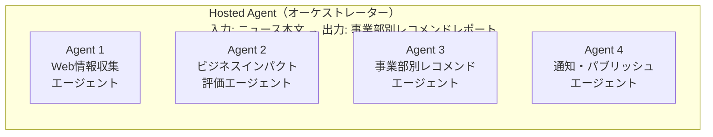
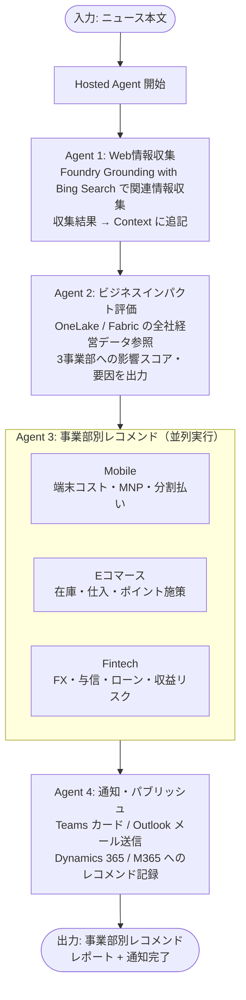

# 01. システム全体像・エージェント構成・フロー概要

関連: [開発計画 README](README.md) | [シナリオ文書](../scenario/business-system-news-analysis-scenario.md)

---

## 目的

外部ニュース（為替急変・競合統合・金融政策転換など）を受け取り、モバイル・Eコマース・Fintech の各事業部内部データと照合して、事業部別インサイトと Next Action を自動生成する。

> 本仕様は **Demo 想定の最低限構成**。Microsoft Agent Framework for .NET の **Workflow + DevUI** を採用し、開発/デモ時の可視化と実行を両立する。

---

## エージェント構成



| エージェント | 名称 | 役割 |
|---|---|---|
| Agent 1 | Web情報収集エージェント | ニュースの背景情報・関連情報を Web / Bing 検索で補完 |
| Agent 2 | ビジネスインパクト評価エージェント | 補完情報と全社経営データを照合し影響範囲を評価 |
| Agent 3 | 事業部別レコメンドエージェント | 各事業部の業務システムデータを参照し Next Action を生成 |
| Agent 4 | 通知エージェント | Teams / M365 経由で各事業部責任者へ送信 |
| Hosted Agent | オーケストレーター | Agent1〜4 の実行順序・状態・エラーを制御 |

---

## 実行フロー



---

## コンテキスト伝播設計

各エージェントは **共有コンテキストオブジェクト（`NewsAnalysisContext`）** を介してデータを受け渡す。Hosted Agent（= Workflow 実行ホスト）がこのオブジェクトの所有者となり、各ステップの出力を順次追記する。Workflow グラフの各ノードは `NewsAnalysisContext` を入出力とする。

```csharp
public class NewsAnalysisContext
{
    public string OriginalNewsText { get; init; } = string.Empty;     // 入力ニュース原文
    public WebResearchResult? WebResearchResult { get; set; }         // Agent1 出力
    public BusinessImpactResult? ImpactResult { get; set; }           // Agent2 出力
    public List<DivisionRecommendation> Recommendations { get; set; } = []; // Agent3 出力
    public NotificationResult? NotificationResult { get; set; }       // Agent4 出力
}
```

> 詳細な Workflow / DevUI 構成は [03-hosted-agent-spec.md](03-hosted-agent-spec.md) を参照。

---

## 対象シナリオ

| シナリオ | 想定ニュース | 主要インサイト |
|---|---|---|
| シナリオ1 | 為替急変（円安ショック） | 端末仕入コスト・越境EC粗利・FX収益リスク |
| シナリオ2 | 競合経済圏の大型統合 | MNP動向・ポイント競争・カードシェア |
| シナリオ3 | 日銀金融政策転換（利上げ） | 分割払いコスト・消費マインド・住宅ローン金利 |
