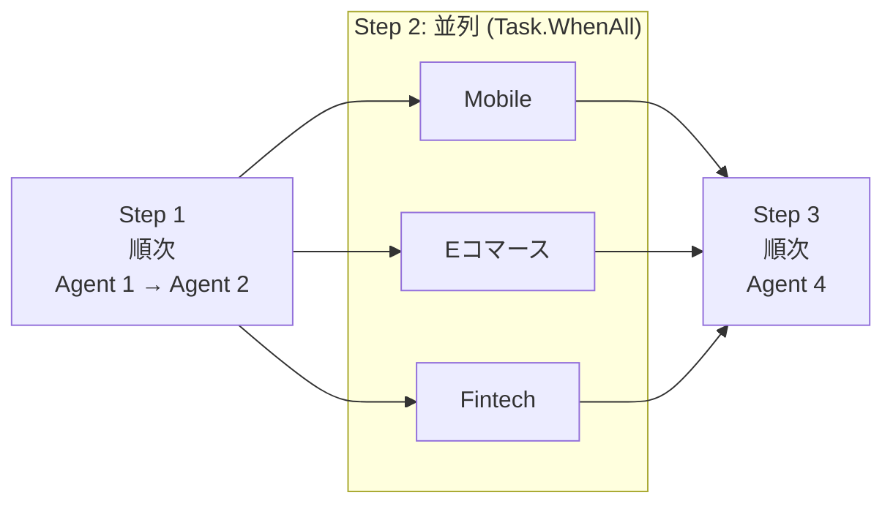

# 03. Hosted Agent（オーケストレーター）仕様

関連: [開発計画 README](README.md) | [全体像](01-overview.md) | [Agent 定義](02-agent-definitions.md)

---

## 役割と責務

Hosted Agent はエージェントワークフローの **オーケストレーター** として機能する。
Agent1〜4 の実行管理・コンテキスト伝播・エラーハンドリング・リトライを担う。

| 責務 | 詳細 |
|---|---|
| フロー制御 | Agent1→2→3（並列）→4 の実行順序を管理 |
| コンテキスト管理 | `NewsAnalysisContext` を保持し各ステップ結果を集約 |
| エラーハンドリング | 各エージェントの失敗を検知し、部分成功でも継続 |
| ログ・トレース | 各エージェントの実行結果・所要時間を記録 |
| 入出力 | ニュース本文を受け付け、最終レポートを返す |

---

## Hosted Agent の実装方針

Microsoft Agent Framework の Agent / Tool 抽象は利用しつつ、
マルチエージェントの実行順序は **カスタムオーケストレーター** として `NewsAnalysisOrchestrator` クラスで明示的に制御する。
これにより実行フローを明示的にコードで制御し、デバッグ・テストを容易にする。



---

## 主要クラス設計

### `NewsAnalysisOrchestrator`

```csharp
/// <summary>
/// Agent 1〜4 をワークフロー的に制御するオーケストレーター
/// </summary>
public sealed class NewsAnalysisOrchestrator
{
    private readonly WebResearchAgent _webResearchAgent;
    private readonly BusinessImpactAgent _impactAgent;
    private readonly DivisionRecommendAgentFactory _recommendFactory;
    private readonly NotificationAgent _notificationAgent;
    private readonly ILogger<NewsAnalysisOrchestrator> _logger;

    public async Task<NewsAnalysisContext> RunAsync(
        string newsText,
        CancellationToken cancellationToken = default)
    {
        var context = new NewsAnalysisContext { OriginalNewsText = newsText };

        // Step 1: Web 情報収集（Agent 1）
        context.WebResearchResult = await _webResearchAgent
            .RunAsync(newsText, cancellationToken);

        // Step 2: ビジネスインパクト評価（Agent 2）
        context.ImpactResult = await _impactAgent
            .RunAsync(context.WebResearchResult, cancellationToken);

        // Step 3: 事業部別レコメンド（Agent 3 × 3 並列）
        var divisionTasks = new[] { "mobile", "ecommerce", "fintech" }
            .Select(div => _recommendFactory
                .Create(div)
                .RunAsync(context.ImpactResult, div, cancellationToken));
        context.Recommendations = [.. await Task.WhenAll(divisionTasks)];

        // Step 4: 通知・パブリッシュ（Agent 4）
        context.NotificationResult = await _notificationAgent
            .RunAsync(context.Recommendations, cancellationToken);

        return context;
    }
}
```

### `NewsAnalysisContext`

```csharp
public sealed class NewsAnalysisContext
{
    public string OriginalNewsText { get; init; } = string.Empty;
    public WebResearchResult? WebResearchResult { get; set; }
    public BusinessImpactResult? ImpactResult { get; set; }
    public List<DivisionRecommendation> Recommendations { get; set; } = [];
    public NotificationResult? NotificationResult { get; set; }
    public DateTimeOffset StartedAt { get; } = DateTimeOffset.UtcNow;
    public DateTimeOffset? CompletedAt { get; set; }
}
```

---

## エラーハンドリング方針

| 発生箇所 | 対応方針 |
|---|---|
| Agent 1 失敗 | リトライ 3 回。全失敗時は `WebResearchResult = null` でフロー継続。Agent 2 はニュース原文のみで評価。 |
| Agent 2 失敗 | リトライ 3 回。全失敗時はフロー中断し例外をスロー。 |
| Agent 3 特定事業部失敗 | 該当事業部の `Recommendation = null`。他事業部の結果で Agent 4 を継続。 |
| Agent 4 失敗 | リトライ 3 回。全失敗時は通知失敗ログのみ記録し、`context` は返す。 |

```csharp
// リトライポリシー例（Microsoft.Extensions.Resilience / Polly）
ResiliencePipeline retryPipeline = new ResiliencePipelineBuilder()
    .AddRetry(new RetryStrategyOptions
    {
        MaxRetryAttempts = 3,
        Delay = TimeSpan.FromSeconds(2),
        BackoffType = DelayBackoffType.Exponential
    })
    .Build();
```

---

## 入力インターフェース

Hosted Agent は以下のエントリポイントを公開する。

```csharp
// REST API 経由（ASP.NET Core Minimal API）
app.MapPost("/api/analyze", async (
    AnalyzeRequest request,
    NewsAnalysisOrchestrator orchestrator,
    CancellationToken ct) =>
{
    var result = await orchestrator.RunAsync(request.NewsText, ct);
    return Results.Ok(result);
});

// Request モデル
public record AnalyzeRequest(string NewsText, string? ScenarioHint = null);
```

---

## ステート管理

- 実行ステートは **インメモリ** で保持（デモ用途のため永続化なし）。
- 長期保持が必要な場合は Azure Table Storage への書き込みを拡張ポイントとして設ける。
- 各ステップの開始・終了・所要時間は `ILogger` で構造化ログとして出力する。

---

## テスト戦略

| テスト種別 | 対象 | 方針 |
|---|---|---|
| ユニットテスト | 各 Agent クラス | LLM 呼び出しをモック化し、プロンプト組み立て・出力パースを検証 |
| 統合テスト | `NewsAnalysisOrchestrator` | Azure AI Foundry テスト環境に接続して E2E 実行 |
| シナリオテスト | 3 シナリオ × 入力ニュース | 出力レポートの品質を手動確認 |
