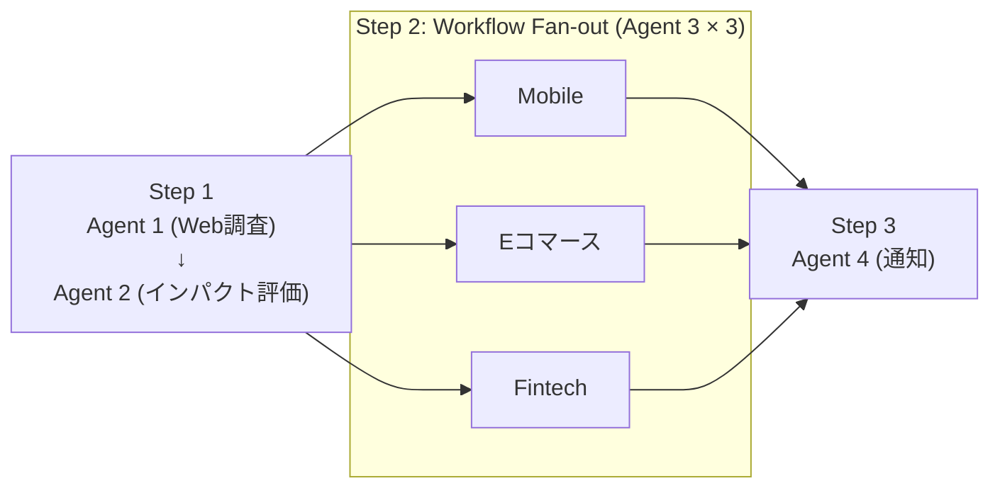

# 03. Hosted Agent（オーケストレーター）仕様

関連: [開発計画 README](README.md) | [全体像](01-overview.md) | [Agent 定義](02-agent-definitions.md)

---

## 役割と責務

Hosted Agent はエージェントワークフローの **オーケストレーター** として機能する。
Agent1〜4 の実行管理・コンテキスト伝播・エラーハンドリング・リトライを担う。

| 責務 | 詳細 |
|---|---|
| フロー制御 | Agent1→2→3（並列）→4 の実行順序を管理 |
| コンテキスト管理 | `NewsAnalysisContext` を保持し各ステップ結果を集約 |
| エラーハンドリング | 各エージェントの失敗を検知し、部分成功でも継続 |
| ログ・トレース | 各エージェントの実行結果・所要時間を記録 |
| 入出力 | ニュース本文を受け付け、最終レポートを返す |

---

## Hosted Agent の実装方針

Microsoft Agent Framework for .NET の **Workflow** を採用し、Agent 1～4 をグラフとして連結する。ホストプロセスは ASP.NET Core **Minimal API** として起動し、Workflow インスタンスを DI で保持して `/api/analyze` から起動する。同じホストプロセスで **Agent Framework DevUI** を併設し、開発/デモ時に Workflow の実行状態・ノード間のデータ・トークン使用量を可視化する。

これにより、**「Hosted Agent」= Minimal API ホスト + NewsAnalysisWorkflow + DevUI** の三つを一体化したデモランタイムと位置づける。



> Step 2 の Fan-out / Fan-in は Workflow の `ParallelExecutor`（または同等の Workflow API）により表現する。コード上で明示的に `Task.WhenAll` を書かず、グラフ定義で並列性を宣言する。

---

## 主要クラス設計

### `NewsAnalysisWorkflowBuilder`

Workflow Builder を使い、各 Agent をノードとして接続する。Workflow の入出力は `NewsAnalysisContext`。

```csharp
/// <summary>
/// Agent 1〜4 を Microsoft Agent Framework Workflow として組み上げるビルダー。
/// DevUI はこの Workflow インスタンスを参照して可視化する。
/// </summary>
public sealed class NewsAnalysisWorkflowBuilder(
    WebResearchAgent webResearchAgent,
    BusinessImpactAgent impactAgent,
    DivisionRecommendAgentFactory recommendFactory,
    NotificationAgent notificationAgent)
{
    public Workflow<NewsAnalysisContext, NewsAnalysisContext> Build()
    {
        return new WorkflowBuilder<NewsAnalysisContext>("news-analysis")
            // Step 1: Web 情報収集
            .AddStep("web-research", webResearchAgent.RunStepAsync)
            // Step 2: ビジネスインパクト評価
            .AddStep("impact-assessment", impactAgent.RunStepAsync)
            // Step 3: 事業部別レコメンド（3 事業部を Fan-out）
            .AddParallelStep("division-recommend",
                new[] { "mobile", "ecommerce", "fintech" },
                (ctx, division, ct) => recommendFactory.Create(division).RunStepAsync(ctx, division, ct))
            // Step 4: 通知
            .AddStep("notification", notificationAgent.RunStepAsync)
            .Build();
    }
}
```

> 上記は概念コード。Microsoft Agent Framework Workflow API の実 API 名・シグネチャは Preview 中のため、実装時に公式サンプルと照合して調整する。参照: [Unlocking enterprise AI complexity: multi-agent orchestration with the Microsoft Agent Framework](https://devblogs.microsoft.com/agent-framework/unlocking-enterprise-ai-complexity-multi-agent-orchestration-with-the-microsoft-agent-framework/)

### `NewsAnalysisContext`

```csharp
public sealed class NewsAnalysisContext
{
    public string OriginalNewsText { get; init; } = string.Empty;
    public WebResearchResult? WebResearchResult { get; set; }
    public BusinessImpactResult? ImpactResult { get; set; }
    public List<DivisionRecommendation> Recommendations { get; set; } = [];
    public NotificationResult? NotificationResult { get; set; }
    public DateTimeOffset StartedAt { get; } = DateTimeOffset.UtcNow;
    public DateTimeOffset? CompletedAt { get; set; }
}
```

---

## エラーハンドリング方針

| 発生箇所 | 対応方針 |
|---|---|
| Agent 1 失敗 | リトライ 3 回。全失敗時は `WebResearchResult = null` でフロー継続。Agent 2 はニュース原文のみで評価。 |
| Agent 2 失敗 | リトライ 3 回。全失敗時は Workflow を中断し 502 と部分結果を返却。 |
| Agent 3 特定事業部失敗 | 該当事業部の `Recommendation = null`。他事業部の結果で Agent 4 を継続。 |
| Agent 4 失敗 | リトライ 3 回。全失敗時は通知失敗ログのみ記録し、`context` は返す。 |

```csharp
// リトライポリシー例（Microsoft.Extensions.Resilience / Polly）
ResiliencePipeline retryPipeline = new ResiliencePipelineBuilder()
    .AddRetry(new RetryStrategyOptions
    {
        MaxRetryAttempts = 3,
        Delay = TimeSpan.FromSeconds(2),
        BackoffType = DelayBackoffType.Exponential
    })
    .Build();
```

---

## 入力インターフェース

Hosted Agent は以下のエントリーポイントを公開する。Demo では認証は設けない（ローカル / 限定環境前提）。

```csharp
// REST API 経由（ASP.NET Core Minimal API）
app.MapPost("/api/analyze", async (
    AnalyzeRequest request,
    Workflow<NewsAnalysisContext, NewsAnalysisContext> workflow,
    CancellationToken ct) =>
{
    var initialContext = new NewsAnalysisContext { OriginalNewsText = request.NewsText };
    var result = await workflow.RunAsync(initialContext, ct);
    return Results.Ok(result);
});

// DevUI エンドポイント（Agent Framework 付属ミドルウェアを mount）
app.MapAgentFrameworkDevUI("/devui");

// Request モデル
public record AnalyzeRequest(string NewsText, string? ScenarioHint = null);
```

> Demo 時は DevUI (`/devui`) をブラウザで開き、Workflow のグラフと各ステップの出力を可視化しながら説明する。

---

## ステート管理

- 実行ステートは **インメモリ** で保持（デモ用途のため永続化なし）。
- 長期保持が必要な場合は Azure Table Storage への書き込みを拡張ポイントとして設ける。
- 各ステップの開始・終了・所要時間は `ILogger` で構造化ログとして出力する。

---

## テスト戦略

| テスト種別 | 対象 | 方針 |
|---|---|---|
| ユニットテスト | 各 Agent クラス | LLM 呼び出しをモック化し、プロンプト組み立て・出力パースを検証 |
| 統合テスト（任意） | `NewsAnalysisWorkflow` | Azure AI Foundry テスト環境に接続して E2E 実行 |
| シナリオテスト | 3 シナリオ × 入力ニュース | DevUI で出力レポートの品質を手動確認 |
