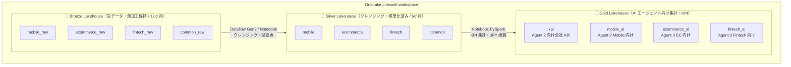
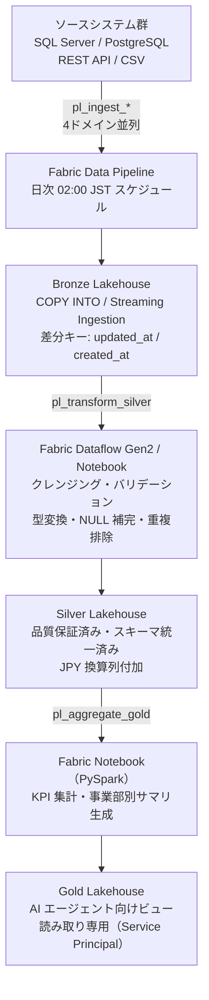

# 06. Microsoft Fabric データ取り込み設計

関連: [開発計画 README](README.md) | [Azure 構成](05-azure-configuration.md) | [データモデル設計](07-fabric-data-model.md)

---

## 前提・規模感

| 項目 | 値 |
|---|---|
| グループ会社規模 | 30,000 名 |
| 対象期間 | 過去 6 ヶ月 |
| 事業部 | モバイル通信・Eコマース・Fintech・共通（顧客統合ID） |
| 更新頻度 | 日次バッチ（一部月次） |
| データ形式（ソース） | RDBMS（SQL Server / PostgreSQL）/ CSV / REST API |

---

## OneLake アーキテクチャ（メダリオン構成）



| レイヤー | 目的 | 形式 | 保持期間 |
|---|---|---|---|
| Bronze | ソースの完全ミラー・監査ログ | Delta Table (Parquet) | 12 ヶ月 |
| Silver | 品質保証済み・スキーマ統一済みデータ | Delta Table | 6 ヶ月 |
| Gold | AI エージェントが直接クエリする集計テーブル | Delta Table | 最新 + 月次スナップ |

---

## データ取り込みパイプライン構成



### パイプライン一覧

| パイプライン名 | ソース | ターゲット | 頻度 |
|---|---|---|---|
| `pl_ingest_mobile` | Mobile DB (SQL Server) | Bronze `mobile_raw` | 日次 |
| `pl_ingest_ecommerce` | EC DB (PostgreSQL) | Bronze `ecommerce_raw` | 日次 |
| `pl_ingest_fintech` | Fintech DB (PostgreSQL) | Bronze `fintech_raw` | 日次 |
| `pl_ingest_common` | 統合ID DB (SQL Server) | Bronze `common_raw` | 日次 |
| `pl_transform_silver` | Bronze 全ドメイン | Silver 全ドメイン | 日次（Bronze 後） |
| `pl_aggregate_gold` | Silver 全ドメイン | Gold 全テーブル | 日次（Silver 後） |

---

## Bronze 取り込み方式

### ① RDBMS ソース（SQL Server / PostgreSQL）

Fabric Data Pipeline の **Copy Activity** を使用。

```
接続: Fabric Gateway 経由のオンプレミスDB、または Azure SQL
モード: 差分取り込み（Incremental Load）
差分キー: updated_at / created_at カラム
完全リロード: 月次 1 回（マスタ系テーブル）
```

```json
// Copy Activity 設定骨子
{
  "source": {
    "type": "SqlServerSource",
    "sqlReaderQuery": "SELECT * FROM contracts WHERE updated_at >= '@{variables('lastLoadTime')}'",
    "partitionOption": "DynamicRange",
    "partitionColumnName": "updated_at"
  },
  "sink": {
    "type": "LakehouseTableSink",
    "tableActionOption": "Append",
    "partitionOption": "PartitionByKey",
    "partitionKeys": ["_ingest_date"]
  }
}
```

### ② REST API ソース（Bing / 外部レート等）

Fabric Notebook (Python) で HTTP 取得 → Bronze に書き込み。

```python
import requests
import pandas as pd
from delta import DeltaTable

def fetch_and_write(url: str, table_path: str):
    resp = requests.get(url, headers={"Ocp-Apim-Subscription-Key": api_key})
    df = pd.DataFrame(resp.json()["value"])
    df["_ingest_date"] = pd.Timestamp.today().date()
    df.to_parquet(f"{table_path}/_ingest_date={df['_ingest_date'].iloc[0]}/part-0.parquet")
```

### ③ CSV / ファイル転送（レガシーシステム連携）

Azure Blob Storage 経由の Fabric **Shortcut** を使用。
- ソースが CSV を SFTP/Blob に出力
- Shortcut でリンクを貼り、Notebook でパース → Bronze に書き込み

---

## Silver 変換ルール

| 変換種別 | 内容 |
|---|---|
| スキーマ統一 | ソース側カラム名を Silver 定義名にリネーム |
| 型変換 | 文字列日付 → `date` / `timestamp`、文字列数値 → `decimal` |
| NULL 補完 | 必須項目が NULL の場合はデフォルト値またはエラーフラグ付与 |
| 重複排除 | 同一主キーの重複行は `updated_at` 降順で最新を残す |
| 文字コード | UTF-8 に統一 |
| 金額通貨 | 原価・請求額は JPY 換算列（`*_jpy`）を付加（為替レートテーブル参照） |
| パーティション | `year_month` (yyyy-MM) 列を付加してパーティション化 |

---

## Gold 集計設計（AI エージェント向け）

### KPI テーブル（Agent 2 向け）

| テーブル | 集計粒度 | 説明 |
|---|---|---|
| `kpi.monthly_revenue` | 事業部 × 月 | 売上・原価・粗利 |
| `kpi.monthly_cost_detail` | 事業部 × コスト種別 × 月 | コスト内訳 |
| `kpi.customer_count` | 事業部 × 月 | 有効顧客数・解約数 |
| `kpi.fx_sensitivity` | 通貨 × 月 | 外貨エクスポージャー |

### 事業部別 AI テーブル（Agent 3 向け）

各事業部の詳細は `07-fabric-data-model.md` を参照。

---

## パイプライン障害対応

| 障害種別 | 対応 |
|---|---|
| Copy Activity 失敗 | Retry 3 回 → アラートメール → 翌日リラン |
| Silver 変換エラー | エラー行は `_error` テーブルに隔離、正常行のみ書き込み継続 |
| Gold 集計失敗 | 前日の Gold を保持したまま再実行、AI エージェントは前日データで稼働継続 |
| データ遅延（ソースが出力遅延） | 最終成功取り込み日時を Gold テーブルのメタデータに記録、Agent 2 が参照時に鮮度チェック |

---

## セキュリティ・アクセス制御

| レイヤー | アクセス主体 | 権限 |
|---|---|---|
| Bronze | Fabric パイプライン / 管理者のみ | 書き込み / 読み取り |
| Silver | データエンジニア・Notebook | 読み取り / 書き込み |
| Gold | AI エージェント（Service Principal） | 読み取りのみ |
| Gold | 各事業部データアナリスト | 読み取りのみ（事業部フィルタ） |

```
AI エージェント用 Service Principal:
  名称: sp-nexus6-ai-agent
  権限: Gold Lakehouse の Reader ロール
  認証: Managed Identity（Hosted Agent の App Service / Container App）
```
