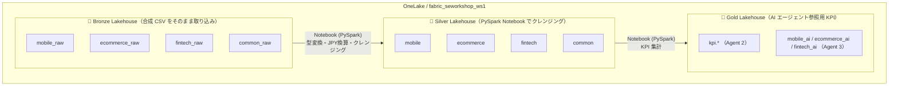
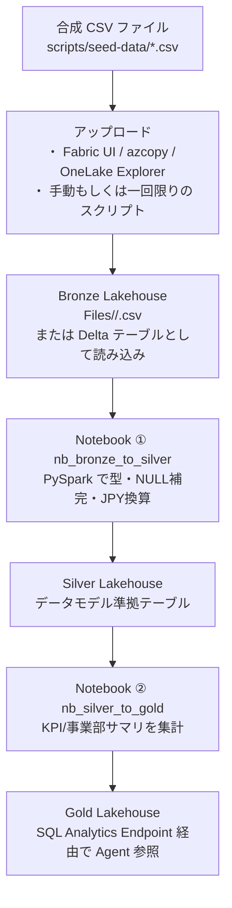

# 06. Microsoft Fabric データ取り込み設計

関連: [開発計画 README](README.md) | [Azure 構成](05-azure-configuration.md) | [データモデル設計](07-fabric-data-model.md)

---

## 前提・規模感

| 項目 | 値 |
|---|---|
| グループ会社規模 | 30,000 名想定 |
| 対象期間 | 過去 6 ヶ月 |
| 事業部 | モバイル通信・Eコマース・Fintech・共通（顧客統合ID） |
| Demo 採用データ形式 | **合成 CSV ファイルのみ**（Bronze コンテナへ手動/スクリプトでアップロード） |
| 更新頻度 | 手動（Demo 中は一回のみ） |

> Demo スコープでは **本番用のソースシステム接続（SQL Server / PostgreSQL / REST API）・Data Pipeline / Dataflow Gen2 / オンプレ Gateway / 日次スケジュールは全て取り扱わない**。本明細は Demo で作る最小限のデータパイプラインに限定し、本番構成は「将来拡張」として脚注で参考示する。

---

## OneLake アーキテクチャ（Demo 簡易メダリオン）



| レイヤー | 目的 | 形式 | Demo での作り方 |
|---|---|---|---|
| Bronze | 合成 CSV をそのまま保持 | Lakehouse Files または Delta Table | CSV を Lakehouse にアップロード |
| Silver | 実データモデルに準拠したスキーマと型を付与 | Delta Table | `nb_bronze_to_silver` Notebook |
| Gold | AI エージェントが T-SQL で参照する集計テーブル | Delta Table | `nb_silver_to_gold` Notebook |

---

## データ取り込みパイプライン構成（Demo）



### スクリプト・ノートブック一覧

| 名前 | 種別 | 用途 |
|---|---|---|
| `scripts/seed-data/generate_csv.py` | Python スクリプト | 合成 CSV（モバイル / EC / Fintech / 共通）を生成 |
| `nb_bronze_to_silver` | Fabric Notebook (PySpark) | Bronze CSV → Silver Delta。型変換・重複排除・JPY 換算 |
| `nb_silver_to_gold` | Fabric Notebook (PySpark) | Silver → Gold KPI 集計（`kpi.*` / `mobile_ai` / `ecommerce_ai` / `fintech_ai`） |

> Demo では Data Pipeline / Dataflow Gen2 / スケジューラーは作成せず、Notebook を手動実行して 1 回だけ Silver/Gold を生成する。

---

## Bronze 取り込み方式（Demo）

### Demo: 合成 CSV の Bronze 取り込み

1. `scripts/seed-data/generate_csv.py` で以下の CSV を生成
   - `mobile_contracts.csv`, `mobile_mnp_history.csv`, `mobile_device_costs.csv`
   - `ecommerce_orders.csv`, `ecommerce_inventory.csv`, `ecommerce_campaign_reactions.csv`
   - `fintech_fx_positions.csv`, `fintech_loan_balances.csv`, `fintech_credit_reviews.csv`
   - `common_customers.csv`
2. Bronze Lakehouse の `Files/<domain>/` 下にアップロード
3. Notebook `nb_bronze_to_silver` で PySpark により `spark.read.csv(...)` → Silver へ書き込み

```python
# nb_bronze_to_silver 例
from pyspark.sql import functions as F

df = (spark.read.option("header", True).option("inferSchema", True)
      .csv("Files/mobile/mobile_contracts.csv"))

silver = (df
    .withColumn("updated_at", F.to_timestamp("updated_at"))
    .dropDuplicates(["contract_id"]))

silver.write.mode("overwrite").saveAsTable("mobile.contracts")
```

### 将来拡張（Demo 対象外）

以下は本番スコープに含まれるが Demo では **作成しない**。

- RDBMS ソースとの Copy Activity（SQL Server / PostgreSQL への Fabric Data Pipeline）
- REST API 取り込み Notebook
- Azure Blob / SFTP への Shortcut
- 日次 02:00 JST スケジュール
- Fabric Gateway を介したオンプレ接続

---

## Silver 変換ルール（Demo）

Demo では `nb_bronze_to_silver` Notebook 1 本で以下を適用する。

| 変換種別 | 内容 |
|---|---|
| スキーマ統一 | CSV カラム名を Silver テーブル定義名にリネーム |
| 型変換 | 文字列日付 → `date` / `timestamp`、文字列数値 → `decimal` |
| NULL 補完 | 必須項目が NULL の場合はデフォルト値・エラーフラグ付与 |
| 重複排除 | 主キー重複行は `updated_at` 降順で最新を残す |
| 金額通貨 | `*_jpy` 列を付与（為替レートは Notebook 内定数） |

> Demo では `_error` テーブルへの隔離は行わず、入力 CSV が事前検査済みであることを前提とする。

---

## Gold 集計設計（AI エージェント向け）

### KPI テーブル（Agent 2 向け）

| テーブル | 集計粒度 | 説明 |
|---|---|---|
| `kpi.monthly_revenue` | 事業部 × 月 | 売上・原価・粗利 |
| `kpi.monthly_cost_detail` | 事業部 × コスト種別 × 月 | コスト内訳 |
| `kpi.customer_count` | 事業部 × 月 | 有効顧客数・解約数 |
| `kpi.fx_sensitivity` | 通貨 × 月 | 外貨エクスポージャー |

### 事業部別 AI テーブル（Agent 3 向け）

各事業部の詳細は `07-fabric-data-model.md` を参照。

---

## パイプライン障害対応（本番設計・Demo 対象外）

以下は本番での推奨設計。Demo では Notebook を手動実行するため障害ハンドリングは実装しない。

| 障害種別 | 対応 |
|---|---|
| Copy Activity 失敗 | Retry 3 回 → アラートメール → 翌日リラン |
| Silver 変換エラー | エラー行は `_error` テーブルに隔離、正常行のみ書き込み継続 |
| Gold 集計失敗 | 前日の Gold を保持したまま再実行、AI エージェントは前日データで稼働継続 |
| データ遅延（ソースが出力遅延） | 最終成功取り込み日時を Gold テーブルのメタデータに記録、Agent 2 が参照時に鮮度チェック |

---

## セキュリティ・アクセス制御

| レイヤー | アクセス主体 | 権限 |
|---|---|---|
| Bronze | データエンジニア・管理者 | 書き込み / 読み取り |
| Silver | データエンジニア・Notebook | 読み取り / 書き込み |
| Gold | AI エージェントをホストする Container Apps の Managed Identity | 読み取りのみ |

```
AI エージェント用 認証:
  方式: System Assigned Managed Identity（Container Apps Consumption）
  権限: Gold Lakehouse / SQL Analytics Endpoint の Reader ロール
  接続: Microsoft.Data.SqlClient + DefaultAzureCredential
```
