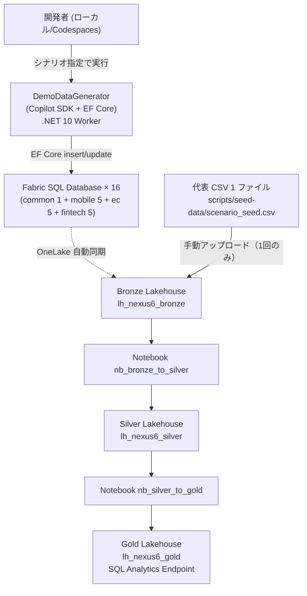

# 06. Microsoft Fabric データ取り込み設計

関連: [開発計画 README](README.md) | [Azure 構成](05-azure-configuration.md) | [データモデル設計](07-fabric-data-model.md)

---

## 前提・規模感

| 項目 | 値 |
|---|---|
| グループ会社規模 | 30,000 名想定 |
| 対象期間 | 過去 6 ヶ月 |
| 事業部 | モバイル通信・Eコマース・Fintech・共通（顧客統合ID） |
| Demo 採用データ生成方式 | **代表 CSV 1 ファイルのみ手動配置** + **`DemoDataGenerator`（Copilot SDK + EF Core）で Fabric SQL Database × 16 に書き込み**（OneLake に自動同期） |
| 更新頻度 | DemoDataGenerator はシナリオ切替時にオンデマンド実行 |

> Demo スコープでは **本番用のソースシステム接続（SQL Server / PostgreSQL / REST API）・Data Pipeline / Dataflow Gen2 / オンプレ Gateway / 日次スケジュールは全て取り扱わない**。本明細は Demo で作る最小限のデータパイプラインに限定し、本番構成は「将来拡張」として脚注で参考示する。

---

## OneLake アーキテクチャ（Demo メダリオン + Fabric SQL DB）

```mermaid
graph TD
    DEMOGEN["DemoDataGenerator\n.NET + Copilot SDK + EF Core\nローカル/Codespaces 実行"]
    CSV["代表 CSV 1 ファイル\n(例: scenario_seed.csv)\n手動配置"]

    subgraph OL["OneLake / fabric_seworkshop_ws1 (F4)"]
        subgraph SQLDB["Fabric SQL Database × 16"]
            SQ1[sqldb_common_01]
            SQ2[sqldb_mobile_01..05]
            SQ3[sqldb_ecommerce_01..05]
            SQ4[sqldb_fintech_01..05]
        end
        subgraph Bronze["🔶 Bronze Lakehouse (lh_nexus6_bronze)"]
            B1[manual_seed_csv]
            B2[SQL DB ミラー\n(domain_raw テーブル群)]
        end
        subgraph Silver["🥈 Silver Lakehouse (lh_nexus6_silver)"]
            S1[mobile / ecommerce / fintech / common]
        end
        subgraph Gold["🥇 Gold Lakehouse (lh_nexus6_gold)"]
            G1["kpi.*（Agent 2）"]
            G2["mobile_ai / ecommerce_ai / fintech_ai（Agent 3）"]
        end
    end

    DEMOGEN -->|EF Core 書き込み| SQLDB
    CSV -->|手動アップロード| Bronze
    SQLDB -.->|OneLake 自動同期| Bronze
    Bronze -->|nb_bronze_to_silver\n型変換・JPY換算・クレンジング| Silver
    Silver -->|nb_silver_to_gold\nKPI 集計| Gold
```

| レイヤー | 目的 | 形式 | Demo での作り方 |
|---|---|---|---|
| **Fabric SQL DB × 16** | リレーショナル形式の生データ。EF Core から書き込み可能 | T-SQL テーブル | `DemoDataGenerator` がオンデマンド生成 |
| Bronze | 代表 CSV 1 つ + SQL DB ミラーデータを保持 | Lakehouse Files / Delta Table | CSV 手動 + Fabric 自動ミラー |
| Silver | 実データモデルに準拠したスキーマと型を付与 | Delta Table | `nb_bronze_to_silver` Notebook |
| Gold | AI エージェントが T-SQL で参照する集計テーブル | Delta Table | `nb_silver_to_gold` Notebook |

---

## データ生成・取り込みパイプライン構成（Demo）



### スクリプト・ノートブック一覧

| 名前 | 種別 | 用途 |
|---|---|---|
| `scripts/seed-data/scenario_seed.csv` | 静的 CSV（1 ファイル） | デモシナリオの起点となる代表データ。手動で Bronze にアップロード |
| `src/DemoDataGenerator/` | .NET 10 Worker | Copilot SDK + EF Core で Fabric SQL DB × 16 に動的データ生成。シナリオ別の波及を表現 |
| `nb_bronze_to_silver` | Fabric Notebook (PySpark) | Bronze 全テーブル → Silver Delta。型変換・重複排除・JPY 換算 |
| `nb_silver_to_gold` | Fabric Notebook (PySpark) | Silver → Gold KPI 集計（`kpi.*` / `mobile_ai` / `ecommerce_ai` / `fintech_ai`） |

> Demo では Data Pipeline / Dataflow Gen2 / スケジューラーは作成せず、Notebook を手動実行して 1 回だけ Silver/Gold を生成する。

---

## Bronze 取り込み方式（Demo）

### 1. 代表 CSV の手動配置（1 ファイルのみ）

シナリオの起点となる「手作りの代表データ」を 1 ファイルだけ用意し、デモ実演時のリアリティと再現性を確保する。

1. `scripts/seed-data/scenario_seed.csv` を手動編集（例: 注目顧客 20 件と取引履歴）
2. Bronze Lakehouse の `Files/manual_seed/` 直下にアップロード（Fabric UI / azcopy / OneLake Explorer）
3. Notebook `nb_bronze_to_silver` で PySpark により `spark.read.csv(...)` → Silver へ書き込み

### 2. DemoDataGenerator による動的生成（残り全部）

シナリオ（為替急変 / 競合統合 / 利上げ）に応じた波及データを Copilot SDK が生成し、EF Core で Fabric SQL DB × 16 に書き込む。詳細は [usecase/copilot-sdk-demo-data-generation.md](../usecase/copilot-sdk-demo-data-generation.md) を参照。

```bash
# DemoDataGenerator 実行例
cd src/DemoDataGenerator
dotnet run -- --scenario fx-shock --customers 30000 --months 6
```

書き込み後、Fabric SQL DB は自動的に OneLake にミラーされるため、Bronze Lakehouse からはミラーテーブル経由でアクセスできる。

```python
# nb_bronze_to_silver 例（CSV と SQL DB ミラーの両方を読む）
from pyspark.sql import functions as F

# 手動配置 CSV
df_seed = (spark.read.option("header", True).option("inferSchema", True)
           .csv("Files/manual_seed/scenario_seed.csv"))

# Fabric SQL DB のミラーテーブル（OneLake 同期されたもの）
df_contracts = spark.read.table("sqldb_mobile_01.dbo.contracts")

silver = (df_contracts
    .unionByName(df_seed, allowMissingColumns=True)
    .withColumn("updated_at", F.to_timestamp("updated_at"))
    .dropDuplicates(["contract_id"]))

silver.write.mode("overwrite").saveAsTable("mobile.contracts")
```

### 将来拡張（Demo 対象外）

以下は本番スコープに含まれるが Demo では **作成しない**。

- RDBMS ソースとの Copy Activity（SQL Server / PostgreSQL への Fabric Data Pipeline）
- REST API 取り込み Notebook
- Azure Blob / SFTP への Shortcut
- 日次 02:00 JST スケジュール
- Fabric Gateway を介したオンプレ接続

---

## Silver 変換ルール（Demo）

Demo では `nb_bronze_to_silver` Notebook 1 本で以下を適用する。

| 変換種別 | 内容 |
|---|---|
| スキーマ統一 | CSV カラム名を Silver テーブル定義名にリネーム |
| 型変換 | 文字列日付 → `date` / `timestamp`、文字列数値 → `decimal` |
| NULL 補完 | 必須項目が NULL の場合はデフォルト値・エラーフラグ付与 |
| 重複排除 | 主キー重複行は `updated_at` 降順で最新を残す |
| 金額通貨 | `*_jpy` 列を付与（為替レートは Notebook 内定数） |

> Demo では `_error` テーブルへの隔離は行わず、入力 CSV が事前検査済みであることを前提とする。

---

## Gold 集計設計（AI エージェント向け）

### KPI テーブル（Agent 2 向け）

| テーブル | 集計粒度 | 説明 |
|---|---|---|
| `kpi.monthly_revenue` | 事業部 × 月 | 売上・原価・粗利 |
| `kpi.monthly_cost_detail` | 事業部 × コスト種別 × 月 | コスト内訳 |
| `kpi.customer_count` | 事業部 × 月 | 有効顧客数・解約数 |
| `kpi.fx_sensitivity` | 通貨 × 月 | 外貨エクスポージャー |

### 事業部別 AI テーブル（Agent 3 向け）

各事業部の詳細は `07-fabric-data-model.md` を参照。

---

## パイプライン障害対応（本番設計・Demo 対象外）

以下は本番での推奨設計。Demo では Notebook を手動実行するため障害ハンドリングは実装しない。

| 障害種別 | 対応 |
|---|---|
| Copy Activity 失敗 | Retry 3 回 → アラートメール → 翌日リラン |
| Silver 変換エラー | エラー行は `_error` テーブルに隔離、正常行のみ書き込み継続 |
| Gold 集計失敗 | 前日の Gold を保持したまま再実行、AI エージェントは前日データで稼働継続 |
| データ遅延（ソースが出力遅延） | 最終成功取り込み日時を Gold テーブルのメタデータに記録、Agent 2 が参照時に鮮度チェック |

---

## セキュリティ・アクセス制御

| レイヤー | アクセス主体 | 権限 |
|---|---|---|
| Bronze | データエンジニア・管理者 | 書き込み / 読み取り |
| Silver | データエンジニア・Notebook | 読み取り / 書き込み |
| Gold | AI エージェントをホストする Container Apps の Managed Identity | 読み取りのみ |

```
AI エージェント用 認証:
  方式: System Assigned Managed Identity（Container Apps Consumption）
  権限: Gold Lakehouse / SQL Analytics Endpoint の Reader ロール
  接続: Microsoft.Data.SqlClient + DefaultAzureCredential
```
