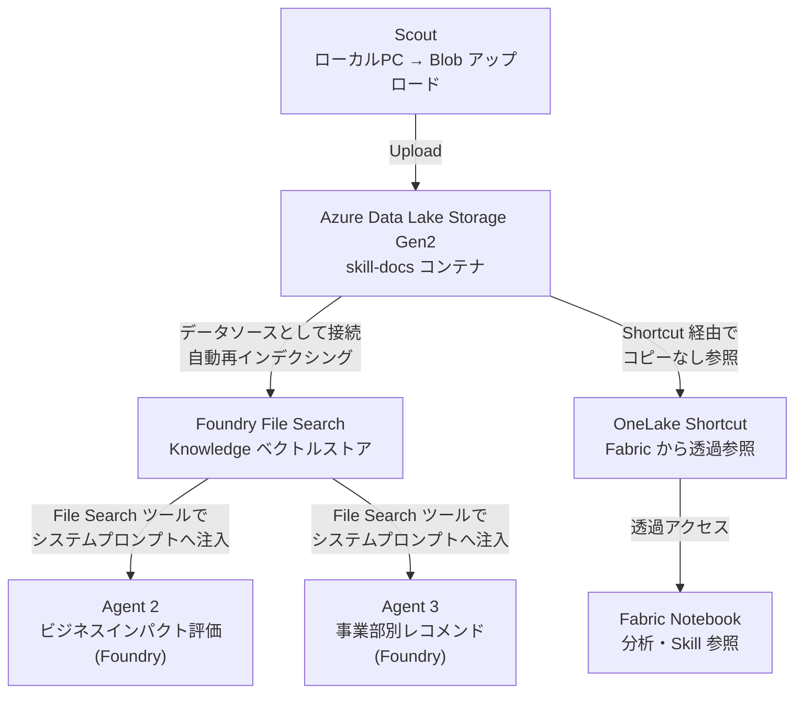
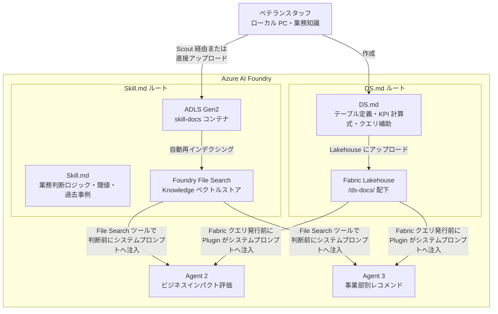

# 08. Skill.md / DS.md 設計（ベテランスタッフ作成ナレッジ）

関連: [開発計画 README](README.md) | [全体像](01-overview.md) | [Fabric データモデル](07-fabric-data-model.md)

---

## 概要

ベテランスタッフが保有する**業務ドメイン知識**を Azure AI Foundry で動く AI エージェントに取り込む手段として、用途の異なる 2 種類のナレッジファイルを定義する。

| ファイル | 目的 | 参照タイミング | 配置場所 | 作成者 |
|---|---|---|---|---|
| **Skill.md** | 業務判断ロジック・分析ノウハウ・閾値・過去事例を記述する | Agent 2・3 がビジネス影響を判断する際にシステムプロンプトへ注入 | **Azure Data Lake Storage Gen2**（ADLS Gen2） | 各事業部のベテランスタッフ |
| **DS.md** | Fabric Lakehouse のテーブル意味・KPI 定義・クエリ補助を記述する | Agent 2・3 が Fabric クエリを発行する直前にシステムプロンプトへ注入 | ADLS Gen2 `skill-docs/ds-docs/`（Lakehouse 連携時は `/ds-docs/` に同期） | データに詳しい業務担当者・IT |

> どちらも **Azure AI Foundry 上で動く .NET Microsoft Agent Framework エージェント（Agent 2・3）** が消費する。  
> Work IQ（Copilot Studio）や SharePoint とは独立したルートで管理する。

---

## Skill.md のストレージ選定：ADLS Gen2 を採用する理由



| 連携先 | ADLS Gen2 との接続方法 | メリット |
|---|---|---|
| **Scout** | Blob SDK / REST API でアップロード | シンプル・追加認証不要 |
| **Azure AI Foundry** | File Search が Blob をデータソースとして自動インデクシング | Foundry Knowledge の標準構成 |
| **Fabric** | OneLake Shortcut（ADLS Gen2 → OneLake）で透過参照 | データコピー不要・Fabric Notebook からそのまま読める |
| **将来的な OneLake 移行** | ADLS Gen2 は OneLake の基盤技術と同一 | 構成変更が最小限 |

> Demo 規模（Skill.md / DS.md 合計 100KB 以下）では Azure AI Search Basic は過剩のため使用せず、Foundry **File Search**（Knowledge ベクトルストア）に統一する。

### ストレージ構成

```
ADLS Gen2 ストレージアカウント: stnexus6skill1t2i
└── コンテナ: skill-docs/
    ├── mobile/
    │   ├── mobile_skill_fx-impact.md
    │   ├── mobile_skill_competitor-mnp.md
    │   └── mobile_skill_boj-installment.md
    ├── ecommerce/
    │   ├── ecommerce_skill_point-competition.md
    │   ├── ecommerce_skill_fx-crossborder.md
    │   └── ecommerce_skill_consumer-sentiment.md
    ├── fintech/
    │   ├── fintech_skill_fx-exposure.md
    │   ├── fintech_skill_card-share.md
    │   └── fintech_skill_mortgage-rate-hike.md
    └── ds-docs/
        ├── ds_kpi_monthly_revenue.md
        ├── ds_mobile_ai.md
        ├── ds_ecommerce_ai.md
        └── ds_fintech_ai.md
```

---



---

## Skill.md の構成

Skill.md は「**この事業のデータをどう読むか**」「**どういう状況でどう判断するか**」をベテランが言語化したファイル。  
**ADLS Gen2** に配置後、Foundry **File Search** が自動再インデクシングしてベクトルストア化。Agent 2・3 がビジネス影響を評価する際に File Search ツールでシステムプロンプトへ注入される。

### 配置ルール

| 項目 | ルール |
|---|---|
| 配置場所 | ADLS Gen2 `stnexus6skill1t2i / skill-docs / {domain}/` |
| ベクトルストア | Foundry File Search（ADLS Gen2 をデータソースとして自動再インデクシング） |
| 参照タイミング | Agent 2・3 の推論中に `FoundryFileSearchTool` が事業部・ニュースキーワードで検索して注入 |
| Fabric 連携 | OneLake Shortcut で `skill-docs` コンテナを透過参照（Notebook から読み取り可） |
| 更新頻度 | 業務ルール・閾値変更時に随時更新（File Search が自動再インデクシング） |

### ファイル構成テンプレート

```markdown
# {事業部名} Skill: {スキル名}

## 適用シナリオ
このスキルが有効な外部事象・ニュースの種類を記述する。

## 判断ロジック
どのデータをどの順序で確認し、何をもって影響ありと判断するかを記述する。

## 閾値・基準値
業務上の重要な数値基準（例: 粗利率 X% を下回ったら要対応）を記述する。

## 過去の事例
類似ニュースが過去に発生した際の社内の動きと結果を記述する（任意）。

## 注意事項・例外
このスキルが適用できないケース・除外条件を記述する。
```

---

## DS.md の構成

DS.md は **ADLS Gen2 `skill-docs/ds-docs/` に配置する**データソース補完ファイル。Lakehouse 連携時は Fabric Files `/ds-docs/` に同期する。  
AI エージェントが Fabric に対してクエリを発行する際に参照され、テーブルのビジネス的意味・KPI 計算式・クエリ上の注意事項を提供する。

> Fabric の SQL Analytics エンドポイントや Notebook が DS.md を読み込み、  
> LLM がスキーマ定義だけでは読み取れない**業務コンテキスト**を補完する。

### 配置ルール

| 項目 | ルール |
|---|---|
| 配置場所 | リポジトリ `knowledge/ds/`、ADLS Gen2 `stnexus6skill1t2i / skill-docs / ds-docs/`（Foundry File Search 用）。Lakehouse 連携時は各 Files `/ds-docs/` に同期 |
| 参照タイミング | `FabricDataPlugin` / `MobileDataPlugin` 等がクエリ前にシステムプロンプトへ注入 |
| 更新頻度 | テーブル追加・KPI 定義変更・業務ルール変更時 |

### ファイル構成テンプレート

```markdown
# {事業部名} Data Source Definition

## 対象 Lakehouse・テーブル一覧
どの Lakehouse のどのテーブルを対象とするかをリストアップする。

## 主要 KPI 定義
業務上使う KPI の名称・計算式・単位・集計粒度を記述する。
AI がクエリを組み立てる際の計算根拠になる。

## 用語・コード値の対応表
業務固有の用語とデータ上のコード値のマッピングを記述する。
（例: "解約" → `cancel_flag = true AND resolved_at IS NOT NULL`）

## データ品質・クエリ上の注意事項
NULL が業務上正常なケース・除外すべき行の条件・集計時の罠を記述する。

## 推奨クエリパターン
分析で頻出するクエリ骨子をコメント付きで記述する。
AI がクエリを生成する際のテンプレートとして機能する。
```

---

## モバイル通信 Skill.md 例

```markdown
# モバイル Skill: 為替急変時の端末コスト影響評価

## 適用シナリオ
- 円安が急進し、USD/JPY が 1 ヶ月で 5 円以上変動した場合
- 海外ベンダーからの端末調達・基地局保守契約の見直しが必要になる局面

## 判断ロジック
1. `mobile.device_costs` で `currency != 'JPY'` の調達コストを抽出
2. 当月の為替レートと前月レートを比較し、円建てコスト増加額を算出
3. コスト増加額 ÷ 端末粗利総額 で「粗利圧縮率」を計算
4. `mobile.installment_details` で `interest_rate` が固定か変動かを確認
5. 変動金利の分割払い残高合計が全体の 30% 超の場合は追加リスクフラグを立てる

## 閾値・基準値
| 指標 | 要注意 | 要対応 |
|---|---|---|
| 粗利圧縮率 | 3% 以上 | 5% 以上 |
| 海外調達比率 | 40% 以上 | 60% 以上 |
| 変動金利分割払い比率 | 25% 以上 | 35% 以上 |

## 過去の事例
2022 年の急激な円安局面では、端末補助額の維持が難しくなり、一部プランの補助上限を
翌月から引き下げた。端末購入者の月額負担増がその後 3 ヶ月で MNP 転出率を 1.2 倍に
押し上げた経緯がある。端末コスト影響とMNP動向は連動して監視すること。

## 注意事項
- 基地局保守の保守契約は長期固定が多いため、短期の為替変動の影響は限定的。
- 国内調達端末（`vendor_region = '国内'`）は為替感応度ゼロとして除外する。
```

---

## モバイル通信 DS.md 例

```markdown
# モバイル Data Source: 契約・課金データ

## データ概要
- Fabric Silver Lakehouse: `mobile.contracts` / `mobile.usage_billing` / `mobile.installment_details`
- 対象: グループ会社 30,000 名の契約状況・月次請求・端末分割払い情報

## 主要 KPI 定義
| KPI 名 | 計算式 | 単位 |
|---|---|---|
| 端末補助負担率 | SUM(subsidy_amount) / SUM(monthly_charge_jpy) | % |
| ARPU | SUM(monthly_charge_jpy) / 有効契約数 | 円/契約 |
| 解約率 | 当月解約件数 / 前月末有効契約数 | % |
| 分割払い残高比率 | SUM(total_amount_jpy - 支払済額) / 総契約数 | 円/契約 |

## 用語集
| 業務用語 | データ上の表現 | 備考 |
|---|---|---|
| 更新月 | `update_month` (yyyy-MM) | 2 年縛り更新のタイミング |
| 端末補助 | `subsidy_amount` | 0 の場合は補助なしプラン |
| SIM のみ | `device_type = 'SIM_ONLY'` | 端末購入なし契約 |
| 基本プラン | `plan_id LIKE 'BASE%'` | オプション除く基本料金プラン |

## データ品質・注意事項
- `resolved_at` が NULL の ticket は未解決。解約率計算に使う際は `cancel_flag = true` AND `resolved_at IS NOT NULL` で絞る。
- 法人契約（`customer_type = '法人'`）は個人とは異なる単価体系のため、分析対象を分けて集計すること。
- `subsidy_amount` は端末代金補助の「月次帳消し額」であり、一括購入時は 0 となる。

## よく使うクエリパターン
```sql
-- 当月の海外調達コストを円建てで集計（為替感応度確認）
SELECT
    vendor_region,
    currency,
    SUM(unit_cost) AS total_original,
    SUM(unit_cost_jpy) AS total_jpy,
    AVG(fx_rate_used) AS avg_fx_rate
FROM mobile.device_costs
WHERE year_month = '2025-06'
  AND currency != 'JPY'
GROUP BY vendor_region, currency
ORDER BY total_jpy DESC;
```
```

---

## Eコマース Skill.md 例

```markdown
# EC Skill: 競合ポイント改定時の離反リスク評価

## 適用シナリオ
- 競合経済圏がポイント還元率を大幅に改定した場合（+1% 以上）
- 自社のポイント相対競争力が低下するニュースが出た場合

## 判断ロジック
1. `ecommerce.campaign_reactions` から直近 3 ヶ月の平均ポイント還元率を取得
2. 競合の新還元率と比較し、自社の「ポイント差」を試算
3. `ecommerce.member_behaviors` でカート離脱率の直近トレンドを確認
4. `ecommerce.point_events` で失効ポイントが多い会員（残高が 0 に近い）を特定
5. 上記会員が Gold/Platinum ランクの場合は離反リスク HIGH とする

## 閾値・基準値
| 指標 | 要注意 | 要対応 |
|---|---|---|
| ポイント還元率差（競合比） | -0.5% | -1.0% 以上 |
| カート離脱率（前月比） | +5pp | +10pp 以上 |
| Gold/Platinum 層の失効予定ポイント比率 | 20% 以上 | 35% 以上 |

## 注意事項
- 季節変動（年末・セール期）は比較期間を同一シーズンで取ること。
- B2B 出店者の仕入動向は `ecommerce.sellers` で別途確認が必要。
```

---

## Fintech DS.md 例

ADLS Gen2 `skill-docs/ds-docs/ds_fintech_ai.md` に配置し、Lakehouse 連携時は Fabric Gold Lakehouse (`fintech_ai`) の `/ds-docs/ds_fintech_ai.md` に同期する。

```markdown
# Fintech Data Source Definition
# 配置: ADLS Gen2 skill-docs/ds-docs/ds_fintech_ai.md

## 対象 Lakehouse・テーブル一覧
| Lakehouse | テーブル | 用途 |
|---|---|---|
| Silver | fintech.accounts | 口座種別・KYC 状態・残高 |
| Silver | fintech.fx_positions | FX・証券・暗号資産ポジション（日次スナップ） |
| Silver | fintech.loan_balances | ローン・リボ払い残高（日次スナップ） |
| Silver | fintech.credit_reviews | 与信・審査履歴 |
| Silver | fintech.fx_rate_snapshots | 為替レートスナップショット（USD/JPY 等） |
| Gold   | fintech_ai.risk_summary | 事業部リスク指標集計（Agent 3 が直接参照） |

## 主要 KPI 定義
| KPI 名 | 計算式 | 単位 | 集計粒度 |
|---|---|---|---|
| FX エクスポージャー | SUM(position_amount × mid_rate) WHERE product_type='FX' | JPY | 通貨別・月 |
| 延滞率 | COUNT(overdue_flag=true) / COUNT(*) | % | 月 |
| 与信否認率 | COUNT(approval_status='否認') / COUNT(*) | % | 月 |
| リボ平均金利 | AVG(interest_rate) WHERE loan_type='リボ払い' | % | 月 |
| リボ残高合計 | SUM(principal_balance_jpy) WHERE loan_type='リボ払い' | JPY | 月 |

## 用語・コード値の対応表
| 業務用語 | テーブル.カラム = 値 | 備考 |
|---|---|---|
| 建玉 | fx_positions.position_amount | FX のオープンポジション（未決済） |
| 評価損益 | fx_positions.pnl_jpy | 前日終値ベースの円換算。日中変動は未反映 |
| KYC 完了 | accounts.kyc_status = 'verified' | 本人確認済み |
| 延滞 | loan_balances.overdue_flag = true | 延滞日数は maturity_date と CURRENT_DATE の差で別途計算 |
| リボ払い残高 | loan_balances WHERE loan_type = 'リボ払い' の principal_balance_jpy | |

## データ品質・クエリ上の注意事項
- `fx_positions` は日次スナップショット。LATEST の値を使う場合は `snapshot_date` でフィルタすること。
  例: `WHERE snapshot_date = (SELECT MAX(snapshot_date) FROM fintech.fx_positions)`
- `pnl_jpy` は `fx_rate_snapshots.mid_rate` で換算済み。JOIN は不要。
- `overdue_flag` は延滞「中」を示すが、延滞日数は持たない。
  延滞日数が必要な場合: `DATEDIFF(day, maturity_date, CAST(GETDATE() AS date))` を使う。
- `accounts.account_type` は普通/投資/外貨/証券などの口座種別を表す。法人/個人区分ではないため、
  顧客属性での切り分けが必要な場合は共通 ID 基盤のセグメント情報を結合する。

## 推奨クエリパターン

```sql
-- 直近月の通貨別 FX エクスポージャー（利上げシナリオ分析向け）
SELECT
    f.market_currency,
    f.product_type,
    SUM(f.position_amount) AS total_position,
    SUM(f.pnl_jpy) AS total_pnl_jpy,
    r.mid_rate AS latest_rate
FROM fintech.fx_positions f
JOIN fintech.fx_rate_snapshots r
    ON f.market_currency = r.base_currency
    AND r.quote_currency = 'JPY'
    AND r.captured_at = (
        SELECT MAX(captured_at) FROM fintech.fx_rate_snapshots
        WHERE base_currency = f.market_currency
          AND quote_currency = 'JPY'
    )
WHERE f.snapshot_date = (SELECT MAX(snapshot_date) FROM fintech.fx_positions)
GROUP BY f.market_currency, f.product_type, r.mid_rate
ORDER BY total_pnl_jpy ASC; -- 損失が大きい順

-- リボ残高と金利の分布（金融政策転換シナリオ向け）
SELECT
    CASE
        WHEN interest_rate < 0.10 THEN '10%未満'
        WHEN interest_rate < 0.15 THEN '10-15%'
        ELSE '15%以上'
    END AS rate_band,
    COUNT(*) AS loan_count,
    SUM(principal_balance_jpy) AS total_balance_jpy,
    SUM(monthly_payment_jpy) AS total_monthly_payment_jpy
FROM fintech.loan_balances
WHERE loan_type = 'リボ払い'
  AND snapshot_date = (SELECT MAX(snapshot_date) FROM fintech.loan_balances)
  AND overdue_flag = false
GROUP BY rate_band
ORDER BY rate_band;
```
```

---

## ファイル管理・運用ルール

| 項目 | Skill.md | DS.md |
|---|---|---|
| 配置場所 | **ADLS Gen2** `skill-docs/{domain}/` | **ADLS Gen2** `skill-docs/ds-docs/`（Lakehouse 連携時は `/ds-docs/` に同期） |
| ファイル命名 | `{domain}_skill_{topic}.md` | `ds_<scope>.md`（例: `ds_mobile_ai.md`） |
| 更新頻度 | 業務ルール・閾値変更時 | テーブル追加・KPI 定義変更時 |
| レビュー | 事業部長が承認 | データオーナー（IT + 業務担当）が承認 |
| バージョン管理 | ADLS Gen2 の Blob バージョニング | ADLS Gen2 の Blob バージョニング（Lakehouse 同期後は Fabric Files 履歴も利用） |
| AI への反映 | Blob 更新 → File Search 自動再インデクシング → Agent 2・3 が File Search ツールで参照 | Blob 更新 → File Search 再インデクシング、Lakehouse 同期後は Plugin がクエリ前に読み込み |
| Fabric との連携 | OneLake Shortcut で透過参照（コピー不要） | Lakehouse Files `/ds-docs/` へ同期 |
| Work IQ との関係 | **無関係**（Foundry エージェント専用） | **無関係**（Foundry エージェント専用） |

### ファイル一覧（初期作成対象）

| ファイル名 | 種別 | 配置場所 | 担当 | 優先度 |
|---|---|---|---|---|
| `mobile_skill_fx-impact.md` | Skill | ADLS Gen2 / File Search | モバイル 財務担当 | 高 |
| `mobile_skill_competitor-mnp.md` | Skill | ADLS Gen2 / File Search | モバイル 営業企画 | 高 |
| `mobile_skill_boj-installment.md` | Skill | ADLS Gen2 / File Search | モバイル 財務担当 | 高 |
| `ecommerce_skill_point-competition.md` | Skill | ADLS Gen2 / File Search | EC マーケティング | 高 |
| `ecommerce_skill_fx-crossborder.md` | Skill | ADLS Gen2 / File Search | EC 商品部 | 高 |
| `ecommerce_skill_consumer-sentiment.md` | Skill | ADLS Gen2 / File Search | EC マーケティング | 高 |
| `fintech_skill_fx-exposure.md` | Skill | ADLS Gen2 / File Search | Fintech リスク管理 | 高 |
| `fintech_skill_card-share.md` | Skill | ADLS Gen2 / File Search | Fintech 決済企画 | 高 |
| `fintech_skill_mortgage-rate-hike.md` | Skill | ADLS Gen2 / File Search | Fintech 与信管理 | 高 |
| `ds_kpi_monthly_revenue.md` | DS | ADLS Gen2 `skill-docs/ds-docs/` | 全社 IT | 高 |
| `ds_mobile_ai.md` | DS | ADLS Gen2 `skill-docs/ds-docs/` | モバイル IT | 高 |
| `ds_ecommerce_ai.md` | DS | ADLS Gen2 `skill-docs/ds-docs/` | EC IT | 高 |
| `ds_fintech_ai.md` | DS | ADLS Gen2 `skill-docs/ds-docs/` | Fintech IT | 高 |
