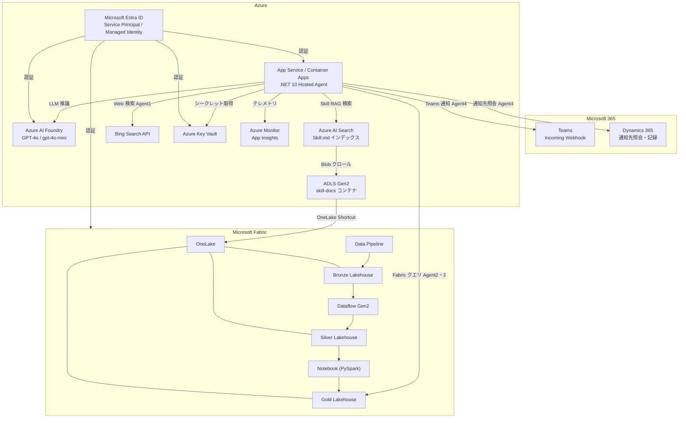
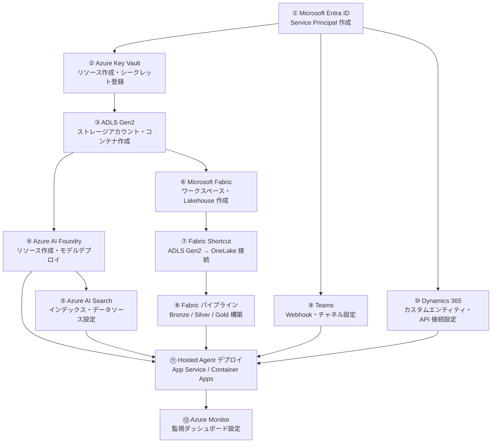

# 09. Azure / M365 必要構成まとめ

関連: [開発計画 README](README.md) | [Azure 詳細設定](05-azure-configuration.md) | [Fabric 取り込み設計](06-fabric-data-ingestion.md) | [Skill/DS 設計](08-skill-ds-design.md)

---

## サービス全体マップ

---

## Azure サービス一覧

### 必須サービス

| サービス | SKU / ティア | 用途 | 参照エージェント |
|---|---|---|---|
| **Azure AI Foundry** | Standard（リージョン: Japan East） | LLM 推論（GPT-4o / gpt-4o-mini） | 全エージェント |
| **Azure AI Search** | Basic 以上 | Skill.md の RAG インデックス | Agent 2・3 |
| **ADLS Gen2** | Standard LRS | Skill.md ファイル格納・OneLake Shortcut 基盤 | Agent 2・3 / Fabric |
| **Bing Search API** | S1 以上 | Web 情報収集 | Agent 1 |
| **Azure Key Vault** | Standard | シークレット一元管理 | 全サービス |
| **Azure App Service / Container Apps** | P1v3 以上 / Consumption | .NET 10 Hosted Agent のホスティング | - |
| **Microsoft Entra ID** | 既存テナント | Service Principal・Managed Identity | 全サービス |

### 推奨サービス

| サービス | SKU / ティア | 用途 |
|---|---|---|
| **Azure Monitor / App Insights** | Pay-as-you-go | エージェント実行ログ・トークン使用量・レイテンシ監視 |
| **Azure Container Registry** | Basic | .NET 10 コンテナイメージ管理（Container Apps 利用時） |

---

## Azure AI Foundry 構成詳細

| 項目 | 設定値 |
|---|---|
| リソース名 | `nexus6-foundry` |
| リージョン | Japan East |
| モデルデプロイ 1 | `gpt-4o`（Agent 1・2・3 用） |
| モデルデプロイ 2 | `gpt-4o-mini`（Agent 4 用） |
| AI Search 接続 | `nexus6-skill-index`（Skill.md RAG） |
| Fabric 接続 | OneLake データ接続（Gold Lakehouse） |

### モデル設定

| エージェント | デプロイ名 | 最大トークン | 温度 |
|---|---|---|---|
| Agent 1 (Web収集) | `gpt-4o` | 4,096 | 0.3 |
| Agent 2 (インパクト評価) | `gpt-4o` | 8,192 | 0.1 |
| Agent 3 (レコメンド × 3事業部) | `gpt-4o` | 8,192 | 0.2 |
| Agent 4 (通知) | `gpt-4o-mini` | 2,048 | 0.0 |

---

## Azure AI Search 構成詳細

| 項目 | 設定値 |
|---|---|
| リソース名 | `nexus6-aisearch` |
| インデックス名 | `nexus6-skill-index` |
| データソース | ADLS Gen2 `nexus6skillstore / skill-docs` |
| クロール頻度 | 1 時間ごと（差分クロール） |
| セマンティック検索 | 有効（Semantic Ranker） |
| フィールド | `domain`, `topic`, `content`, `scenario_tags` |

---

## ADLS Gen2 構成詳細

| 項目 | 設定値 |
|---|---|
| アカウント名 | `nexus6skillstore` |
| 冗長性 | LRS（デモ用途） |
| コンテナ名 | `skill-docs` |
| ディレクトリ構成 | `mobile/`, `ecommerce/`, `fintech/` |
| Fabric 連携 | OneLake Shortcut（`skill-docs` → `nexus6-workspace/Files/skill-docs`） |
| アクセス制御 | AI Search：Storage Blob Data Reader ロール |

---

## Microsoft Fabric 構成一覧

| リソース | 名称 | 用途 |
|---|---|---|
| Workspace | `nexus6-workspace` | 全 Fabric リソースの管理単位 |
| Bronze Lakehouse | `nexus6-bronze` | 生データ（ソースミラー・12ヶ月保持） |
| Silver Lakehouse | `nexus6-silver` | クレンジング・標準化済みデータ（6ヶ月保持） |
| Gold Lakehouse | `nexus6-gold` | AI エージェント向け集計テーブル |
| Data Pipeline | `pl_ingest_mobile` 他 4本 | ソース → Bronze 差分取り込み（日次） |
| Data Pipeline | `pl_transform_silver` | Bronze → Silver 変換（日次） |
| Data Pipeline | `pl_aggregate_gold` | Silver → Gold 集計（日次） |
| Dataflow Gen2 | `df_cleanse_{domain}` | クレンジング・型変換ロジック |
| Notebook | `nb_aggregate_gold` | KPI 集計・JPY 換算（PySpark） |
| OneLake Shortcut | `skill-docs` | ADLS Gen2 の Skill.md を透過参照 |

### Fabric ゲートウェイ

オンプレミス DB（SQL Server / PostgreSQL）に接続する場合は **オンプレミスデータゲートウェイ** が必要。

| 項目 | 設定値 |
|---|---|
| ゲートウェイ名 | `nexus6-onprem-gw` |
| 接続先 | Mobile DB (SQL Server)・Fintech/EC DB (PostgreSQL) |
| 認証 | Windows 認証 / SQL 認証 |

---

## M365 サービス一覧

| サービス | 用途 | 担当エージェント | 必須/任意 |
|---|---|---|---|
| **Microsoft Teams** | Adaptive Card でレコメンドを各事業部責任者へ通知 | Agent 4 | 必須 |
| **Dynamics 365** | 通知先担当者情報の照会・レコメンドのレコード登録 | Agent 4 | 必須 |
| **Outlook / M365 Mail** | Teams 通知の補完（任意） | Agent 4 | 任意 |

### Teams 構成

| 項目 | 設定値 |
|---|---|
| 接続方式 | Incoming Webhook（チャネルごとに設定） |
| チャネル構成 | `#mobile-ai-recommend`, `#ecommerce-ai-recommend`, `#fintech-ai-recommend` |
| カード形式 | Adaptive Card v1.5 |
| @メンション | 優先度 HIGH のアクションは担当者をメンション |

### Dynamics 365 構成

| 項目 | 設定値 |
|---|---|
| 接続方式 | Dataverse Web API（Microsoft.PowerPlatform.Dataverse.Client） |
| 用途 1 | 事業部責任者の照会（取引先担当者エンティティ） |
| 用途 2 | AI レコメンドのカスタムエンティティへの記録 |
| 認証 | Service Principal（Entra ID App Registration） |

---

## Microsoft Entra ID 構成

### Service Principal（Hosted Agent 用）

| 項目 | 設定値 |
|---|---|
| アプリ名 | `nexus6-ai-agent-sp` |
| 用途 | Fabric Gold Lakehouse・Dynamics 365・Key Vault へのアクセス |
| 認証方式 | Managed Identity（App Service / Container Apps） |

### ロール割り当て一覧

| リソース | ロール | 付与対象 |
|---|---|---|
| ADLS Gen2 (`nexus6skillstore`) | Storage Blob Data Reader | AI Search サービス |
| Gold Lakehouse (`nexus6-gold`) | Fabric ビューアー | `nexus6-ai-agent-sp` |
| Key Vault (`nexus6-kv`) | Key Vault Secrets User | App Service Managed Identity |
| Dynamics 365 | Dynamics 365 ユーザー | `nexus6-ai-agent-sp` |
| Azure AI Foundry | Cognitive Services User | App Service Managed Identity |

---

## Key Vault シークレット一覧

| シークレット名 | 内容 | 参照箇所 |
|---|---|---|
| `AzureOpenAI--ApiKey` | Azure OpenAI API キー | 全エージェント |
| `BingSearch--ApiKey` | Bing Search v7 API キー | Agent 1 |
| `AzureAISearch--ApiKey` | AI Search 管理キー | SkillSearchPlugin |
| `Teams--Mobile--WebhookUrl` | Teams Mobile チャネル Webhook | Agent 4 |
| `Teams--Ecommerce--WebhookUrl` | Teams EC チャネル Webhook | Agent 4 |
| `Teams--Fintech--WebhookUrl` | Teams Fintech チャネル Webhook | Agent 4 |
| `Dynamics365--ClientSecret` | Dynamics 365 Service Principal シークレット | Agent 4 |
| `AzureMonitor--ConnectionString` | App Insights 接続文字列 | ホスト全体 |

---

## 構築順序（推奨）

---

## コスト概算（月次・デモ規模）

| サービス | 想定コスト帯 | 備考 |
|---|---|---|
| Azure AI Foundry (GPT-4o) | $200〜$500 | デモ頻度・トークン数による |
| Azure AI Search (Basic) | $75 | 固定 |
| ADLS Gen2 | $5 以下 | Skill.md は小容量 |
| Bing Search API (S1) | $7〜$15 | クエリ数による |
| App Service (P1v3) | $70 | 固定 |
| Azure Monitor | $10〜$30 | ログ量による |
| Microsoft Fabric | Fabric 容量ライセンス依存 | F2〜F4 相当 |
| Dynamics 365 | 既存ライセンス前提 | 新規不要の場合が多い |
| **合計目安** | **$370〜$700 / 月** | Fabric・D365 除く |
