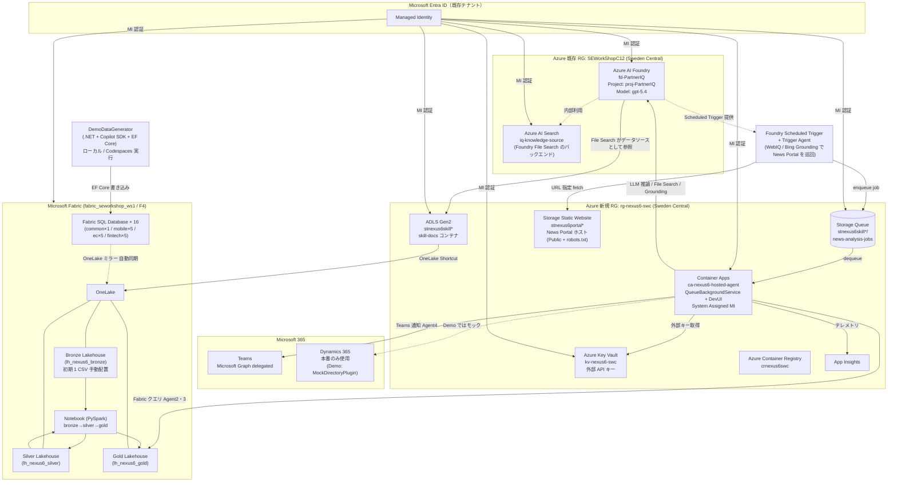
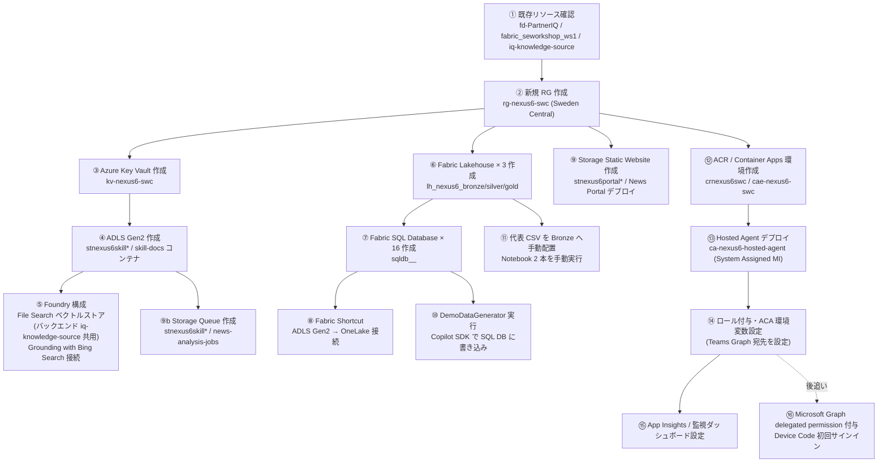

# 09. Azure / M365 必要構成まとめ

関連: [開発計画 README](README.md) | [Azure 詳細設定](05-azure-configuration.md) | [Fabric 取り込み設計](06-fabric-data-ingestion.md) | [Skill/DS 設計](08-skill-ds-design.md)

---

## サービス全体マップ

---

## Azure サービス一覧

### 既存利用リソース（RG: `SEWorkShopC12` / Sweden Central）

| サービス | リソース名 | SKU | 用途 |
|---|---|---|---|
| **Azure AI Foundry** | `fd-PartnerIQ` | S0 (AIServices) | LLM 推論（`gpt-5.4`）、File Search、Grounding with Bing Search |
| **Foundry Project** | `proj-PartnerIQ` | - | Agent 実行 / Knowledge 管理 |
| **モデルデプロイ** | `gpt-5.4` (GlobalStandard / 500) | - | 全エージェントで共用 |
| **モデルデプロイ** | `text-embedding-3-large` (Standard / 120) | - | File Search のベクトル化 |
| **Azure AI Search** | `iq-knowledge-source` | Standard | Foundry File Search のバックエンドとして共用 |
| **Microsoft Fabric Capacity** | `fabricswedencu001` | F4 | 全 Fabric リソースの容量 |
| **Microsoft Fabric Workspace** | `fabric_seworkshop_ws1` | - | Lakehouse / SQL DB / Notebook を配置 |

### 新規作成リソース（新規 RG: `rg-nexus6-swc` / Sweden Central）

`<NNNN>` の採用値は `1t2i`。確定経緯は [11. 命名規約](11-naming-conventions.md#採用済み-nnnn) を参照。

| サービス | リソース名（案） | SKU | 用途 |
|---|---|---|---|
| **ADLS Gen2** | `stnexus6skill<NNNN>` | Standard LRS | Skill.md ファイル格納・OneLake Shortcut 基盤 |
| **Storage Static Website** | `stnexus6portal<NNNN>` | Standard LRS | News Portal ホスト（Public + `robots.txt` で検索除外） |
| **Azure Storage Queue** | `stnexus6skill<NNNN>` 内の `news-analysis-jobs` | Standard LRS | Foundry Trigger Agent → Hosted Agent の内部チャネル |
| **Azure Key Vault** | `kv-nexus6-swc` | Standard | 外部 API キー、Teams Graph delegated refresh token |
| **Azure Container Apps Env** | `cae-nexus6-swc` | Consumption | Hosted Agent 実行環境 |
| **Azure Container App** | `ca-nexus6-hosted-agent` | Consumption | .NET 10 Hosted Agent（System Assigned MI） |
| **Azure Container Registry** | `crnexus6swc` | Basic | コンテナイメージ管理 |
| **Application Insights** | `appi-nexus6-swc` | Pay-as-you-go | テレメトリ・ログ |
| **Fabric SQL Database × 16** | `sqldb_<domain>_<NN>` | - | DemoDataGenerator 書き込み先（`fabric_seworkshop_ws1` 内に作成） |
| **Fabric Lakehouse × 3** | `lh_nexus6_bronze` / `lh_nexus6_silver` / `lh_nexus6_gold` | - | Bronze/Silver/Gold（`fabric_seworkshop_ws1` 内） |
| **Fabric Notebook × 2** | `nb_bronze_to_silver` / `nb_silver_to_gold` | - | PySpark で変換実行 |

### Demo では使用しないサービス

| サービス | 理由 |
|---|---|
| **Bing Search v7 API（単体）** | 新規受付停止。Foundry 組込の Grounding with Bing Search を使用 |
| **App Service （P1v3）** | Container Apps Consumption と重複 |
| **専用 Azure AI Search の新規作成** | 既存の `iq-knowledge-source` を Foundry File Search のバックエンドとして共用 |
| **Dynamics 365** | Demo は `MockDirectoryPlugin` で代替 |

---

## Azure AI Foundry 構成詳細

| 項目 | 設定値 |
|---|---|
| リソース名 | `fd-PartnerIQ` |
| リージョン | `Sweden Central` |
| リソースグループ | `SEWorkShopC12`（既存） |
| Project 名 | `proj-PartnerIQ` |
| Project Endpoint | `https://fd-partneriq.services.ai.azure.com/api/projects/proj-PartnerIQ` |
| OpenAI Endpoint (legacy) | `https://fd-partneriq.openai.azure.com/` |
| モデルデプロイ | `gpt-5.4`（GlobalStandard / 容量 500）※全エージェント共通 |
| 埋め込みモデル | `text-embedding-3-large`（Standard / 容量 120） |
| Knowledge / File Search | `vs_nexus6_skilldocs`（新規ベクトルストア。バックエンドは既存 `iq-knowledge-source`） |
| Grounding with Bing Search 接続 | Foundry Connections で追加し Connection ID を保持 |
| Fabric 接続 | OneLake / SQL Analytics Endpoint（Gold Lakehouse） |
| 認証 | Container Apps の System Assigned MI に `Cognitive Services User` を付与 |

### モデル設定

Foundry で `gpt-5.4` のみがデプロイされているため、全エージェントを同一モデルで運用し、温度・最大トークンのみ差別化する。

| エージェント | デプロイ名 | 最大トークン | 温度 |
|---|---|---|---|
| Agent 1 (Web収集) | `gpt-5.4` | 4,096 | 0.3 |
| Agent 2 (インパクト評価) | `gpt-5.4` | 8,192 | 0.1 |
| Agent 3 (レコメンド × 3事業部) | `gpt-5.4` | 8,192 | 0.2 |
| Agent 4 (通知) | `gpt-5.4` | 2,048 | 0.0 |

> 将来 `gpt-5-mini` 等が利用可能になった場合、Agent 4 のみ差し替え可能（`appsettings.json` の `Foundry:NotificationModelDeployment` で切替）。

---

## Foundry Scheduled Trigger（News Portal 巡回ジョブ）

Hosted Agent への起動契機を提供する Foundry 側コンポーネント。Foundry Agent Service の Scheduled Trigger（Preview）と専用 Trigger Agent を組み合わせる。

| 項目 | 設定値 |
|---|---|
| トリガー種別 | Foundry Agent Service **Scheduled Trigger**（Preview / cron 式） |
| 実行間隔 | Demo 用途は 5〜15 分（実演時のみ手動 Run） |
| Trigger Agent 名 | `news-portal-poller` |
| Trigger Agent 役割 | 1) WebIQ / Grounding with Bing Search で **News Portal の BLOB URL を fetch** し記事一覧を取得 2) 未処理記事を判定（過去 enqueue 履歴は Storage Queue または Blob `processed/` で管理） 3) 各記事の本文と URL を `NewsAnalysisJob` JSON にして Azure Storage Queue (`news-analysis-jobs`) に enqueue |
| Trigger Agent モデル | `gpt-5.4` |
| Trigger Agent Tool | WebIQ / Grounding with Bing Search、Storage Queue 書込（Function Tool として実装） |
| 認証 | Foundry の Managed Identity に `Storage Queue Data Message Sender` を付与 |

> Hosted Agent 側はこの Queue を購読する `QueueBackgroundService` のみを起動契機とする。News Portal 側に「分析開始」ボタンや JS の API 呼び出しは **一切持たせない**。

---

## Foundry File Search（Skill.md / DS.md ベクトルストア）

| 項目 | 設定値 |
|---|---|
| ベクトルストア名 | `vs_nexus6_skilldocs` |
| バックエンド（Azure AI Search） | 既存 `iq-knowledge-source`（RG `SEWorkShopC12` / Sweden Central）を共用 |
| データソース | ADLS Gen2 `stnexus6skill<NNNN> / skill-docs` |
| 埋め込みモデル | `text-embedding-3-large` |
| 再インデクシング | Foundry が Blob 変更を検知して自動実行 |
| チャンク分割 | デフォルト（1024 tokens 目安） |
| Agent 2・3 での利用 | `FoundryFileSearchTool`、Vector Store ID を `Foundry:FileSearchVectorStoreId` で供給 |

---

## ADLS Gen2 構成詳細

| 項目 | 設定値 |
|---|---|
| アカウント名 | `stnexus6skill<NNNN>`（グローバル一意の数値サフィックス） |
| リソースグループ | `rg-nexus6-swc`（新規） |
| リージョン | `Sweden Central` |
| 冗長性 | LRS（デモ用途） |
| コンテナ名 | `skill-docs` |
| ディレクトリ構成 | `mobile/`, `ecommerce/`, `fintech/` |
| Fabric 連携 | OneLake Shortcut（`skill-docs` → `fabric_seworkshop_ws1/Files/skill-docs`） |
| アクセス制御 | Foundry File Search・Container Apps MI に `Storage Blob Data Reader` を付与 |

---

## News Portal Static Hosting

外部ニュースサイトの「読み取り対象」として動作する静的サイト。**人間がブラウザで閲覧することは想定せず**、Foundry 側のタイマートリガーが定期的に URL を fetch して新着記事を AI 分析パイプラインへ流す入力源となる。

| 項目 | 設定値 |
|---|---|
| ホスト方式 | **Azure Storage Static Website**（`$web` コンテナ） |
| アカウント名 | `stnexus6portal<NNNN>` |
| リソースグループ | `rg-nexus6-swc`（新規） |
| リージョン | `Sweden Central` |
| 公開範囲 | Public（Foundry / Bing Grounding が URL fetch するため） |
| 検索エンジン除外 | `robots.txt` で `Disallow: /` を設定し外部クローラーをブロック |
| デプロイ対象 | `src/news-portal/` 配下の静的 HTML（`index.html` / `article-*.html`） |
| 起動契機 | **Foundry Scheduled Trigger** が定期起動 → Foundry Trigger Agent が WebIQ/Bing Grounding で記事 URL を巡回 → Azure Storage Queue (`news-analysis-jobs`) に enqueue → Hosted Agent が dequeue して Workflow 実行 |
| Foundry からの利用 | WebIQ または Grounding with Bing Search に **BLOB URL を直接指定**して記事本文を取得 |

> 厳密な Private 制御（IP 制限・Private Endpoint）は Demo スコープ外。`robots.txt` で検索インデックス除外し、URL 共有も限定範囲に留める運用で対応する。
> News Portal 側に「分析開始」ボタンや JavaScript の API 呼び出しは **含めない**。あくまで読み取られる対象としての静的記事のみを置く。

---

## Microsoft Fabric 構成一覧

すべて既存ワークスペース `fabric_seworkshop_ws1`（Capacity `fabricswedencu001` / F4 / Sweden Central）内に作成する。

| リソース | 名称 | 用途 |
|---|---|---|
| Workspace | `fabric_seworkshop_ws1`（既存） | 全 Fabric リソースの管理単位 |
| Fabric SQL Database × 16 | `sqldb_common_01`、`sqldb_mobile_01`〜`05`、`sqldb_ecommerce_01`〜`05`、`sqldb_fintech_01`〜`05` | DemoDataGenerator（Copilot SDK + EF Core）の書き込み先 |
| Bronze Lakehouse | `lh_nexus6_bronze` | 手動配置の代表 CSV + Fabric SQL DB からの OneLake ミラーを集約 |
| Silver Lakehouse | `lh_nexus6_silver` | クレンジング・型整備済みデータ |
| Gold Lakehouse | `lh_nexus6_gold` | AI エージェント向け集計テーブル |
| Notebook | `nb_bronze_to_silver` | Bronze → Silver 変換（PySpark） |
| Notebook | `nb_silver_to_gold` | Silver → Gold KPI 集計（PySpark） |
| OneLake Shortcut | `skill-docs` | ADLS Gen2 の Skill.md を透過参照 |
| DataAgent | `seworkshop-data-agent`（既存） | 当初検証用。本構成では不使用 |

> Demo では Data Pipeline / Dataflow Gen2 / スケジューラーは作成せず Notebook を手動実行する。オンプレデータゲートウェイも不要。
> Fabric SQL Database → OneLake への同期は Fabric が自動的に行うため、追加のパイプライン定義は不要。

---

## M365 サービス一覧

| サービス | 用途 | 担当エージェント | 必須/任意 |
|---|---|---|---|
| **Microsoft Teams (Graph)** | Microsoft Graph でレコメンドを各事業部責任者へ通知 | Agent 4 | 必須 |
| **Dynamics 365** | 本番での担当者ディレクトリ・レコメンド記録 | Agent 4 | **Demo では使わずモック** |
| **Outlook / M365 Mail** | Demo スコープ外（使用しない） | - | 対象外 |

### Teams 構成（Microsoft Graph delegated）

| 項目 | 設定値 |
|---|---|
| 接続方式 | Microsoft Graph `POST /teams/{teamId}/channels/{channelId}/messages` |
| テナント | `9e575763-d389-4aa8-b0a9-a64ba4cc1029`（Azure 管理テナントと同一） |
| チャネル構成 | **作成済み**。各事業部チームの `Web Pulse Recommender` チャネルへ Agent 4 が通知（下表参照） |
| 宛先の供給方法 | ACA 環境変数 `Teams__Graph__<Division>__TeamId` / `Teams__Graph__<Division>__ChannelId`（`appsettings.json` でも設定可） |
| 認証 | Public client App Registration + Device Code Flow 初期認証。ACA は Key Vault の refresh token を使い delegated access token を更新 |
| 必要権限 | Delegated `ChannelMessage.Send` / `Group.Read.All` / `offline_access`。application 権限不成立の経緯は [24 章](24-teams-graph.md)、delegated 実装は [25 章](25-teams-delegated.md) |
| カード形式 | Adaptive Card JSON を HTML 本文として投稿 |
| Demo 暫定動作 | refresh token 未登録または Graph 呼び出し失敗時は `MockTeamsPlugin` にフォールバックし、ACA の writable path (`/home/app/.nexus6/logs/teams-mock`) に通知ログを保存 |

#### 通知先チーム / チャネル一覧

| 事業部 (Division) | Teams チーム名 | Team ID (groupId) | チャネル名 | Channel ID | ACA 環境変数 |
|---|---|---|---|---|---|
| `ecommerce` | EC チーム | `54e63170-bad8-42b3-959b-cb1cdaad5b6d` | `Web Pulse Recommender` | `19:e5c7a76a0e6e400ab94a0c2c1f3052b6@thread.tacv2` | `Teams__Graph__Ecommerce__TeamId` / `Teams__Graph__Ecommerce__ChannelId` |
| `mobile` | モバイルチーム | `da1f375e-ab3f-45bd-a8c5-027b1f82a8dc` | `Web Pulse Recommender` | `19:8e4127ee9079478d8b9ae900c9d96454@thread.tacv2` | `Teams__Graph__Mobile__TeamId` / `Teams__Graph__Mobile__ChannelId` |
| `fintech` | 金融チーム | `c0b91401-532b-4092-93d8-1a5850de6027` | `Web Pulse Recommender` | `19:1499aad7b2ea4d838495bc731fb8824b@thread.tacv2` | `Teams__Graph__Fintech__TeamId` / `Teams__Graph__Fintech__ChannelId` |

各チャネルのディープリンク（参照用）:

- EC チーム / Web Pulse Recommender: <https://teams.cloud.microsoft/l/channel/19%3Ae5c7a76a0e6e400ab94a0c2c1f3052b6%40thread.tacv2/Web%20Pulse%20Recommender?groupId=54e63170-bad8-42b3-959b-cb1cdaad5b6d&tenantId=9e575763-d389-4aa8-b0a9-a64ba4cc1029>
- モバイルチーム / Web Pulse Recommender: <https://teams.cloud.microsoft/l/channel/19%3A8e4127ee9079478d8b9ae900c9d96454%40thread.tacv2/Web%20Pulse%20Recommender?groupId=da1f375e-ab3f-45bd-a8c5-027b1f82a8dc&tenantId=9e575763-d389-4aa8-b0a9-a64ba4cc1029>
- 金融チーム / Web Pulse Recommender: <https://teams.cloud.microsoft/l/channel/19%3A1499aad7b2ea4d838495bc731fb8824b%40thread.tacv2/Web%20Pulse%20Recommender?groupId=c0b91401-532b-4092-93d8-1a5850de6027&tenantId=9e575763-d389-4aa8-b0a9-a64ba4cc1029>

> 旧設計は Power Automate Workflows（HTTP トリガー URL を Key Vault に保持）だった。Track U の Managed Identity + application 権限方式は Graph 制約で不成立のため、現設計は Delegated + Device Code Flow に切り替えた。

### Dynamics 365（Demo ではモック）

Demo は `MockDirectoryPlugin`（メモリ内の担当者一覧）で代替する。以下は本番での接続仕様。

| 項目 | 設定値 |
|---|---|
| 接続方式 | Dataverse Web API（Microsoft.PowerPlatform.Dataverse.Client） |
| 用途 1 | 事業部責任者の照会（取引先担当者エンティティ） |
| 用途 2 | AI レコメンドのカスタムエンティティへの記録 |
| 認証 | Service Principal（Entra ID App Registration） |

---

## Microsoft Entra ID 構成

### Managed Identity（Hosted Agent 用）

| 項目 | 設定値 |
|---|---|
| アイデンティティ | Container Apps `ca-nexus6-hosted-agent` の **System Assigned Managed Identity** |
| 用途 | Foundry / Fabric / Key Vault / ADLS / AI Search / Microsoft Graph へのアクセス |
| 認証コード | `DefaultAzureCredential`（.NET 10） |

> Demo では Service Principal シークレットや API キーを使わず、Container Apps の System Assigned MI を Azure リソースの認証に統一する。
> ローカル / Codespaces 実行時は開発者の `az login` 認証情報（`DefaultAzureCredential` の `AzureCliCredential` チェーン）を使用する。

### ロール割り当て一覧

| リソース | ロール | 付与対象 |
|---|---|---|
| Azure AI Foundry (`fd-PartnerIQ`) | Cognitive Services User | Container Apps MI / 開発者 |
| Azure AI Search (`iq-knowledge-source`) | Search Index Data Reader | Foundry MI（File Search のクエリ実行用） |
| ADLS Gen2 (`stnexus6skill<NNNN>`) | Storage Blob Data Reader | Container Apps MI / Foundry File Search |
| ADLS Gen2 (`stnexus6skill<NNNN>`) | Storage Blob Data Contributor | 開発者（Skill.md 配置のため） |
| Storage Queue (`stnexus6skill<NNNN>` / `news-analysis-jobs`) | Storage Queue Data Message Sender | Foundry MI（enqueue） |
| Storage Queue (`stnexus6skill<NNNN>` / `news-analysis-jobs`) | Storage Queue Data Message Processor | Container Apps MI（dequeue） |
| Storage (`stnexus6portal<NNNN>`) | Storage Blob Data Contributor | 開発者（News Portal デプロイ） |
| Fabric Workspace `fabric_seworkshop_ws1` | Viewer | Container Apps MI |
| Fabric Workspace `fabric_seworkshop_ws1` | Contributor | DemoDataGenerator 実行者（開発者） |
| Key Vault (`kv-nexus6-swc`) | Key Vault Secrets User | Container Apps MI |
| Key Vault (`kv-nexus6-swc`) | Key Vault Secrets Officer | Container Apps MI（Teams refresh token rotation） |
| Key Vault (`kv-nexus6-swc`) | Key Vault Secrets Officer | 開発者（シークレット登録用） |
| App Insights (`appi-nexus6-swc`) | Monitoring Metrics Publisher | Container Apps MI |
| ACR (`crnexus6swc`) | AcrPull | Container Apps MI |
| ACR (`crnexus6swc`) | AcrPush | 開発者 / GitHub Actions（任意） |
| Microsoft Graph | Delegated `ChannelMessage.Send` / `Group.Read.All` / `offline_access` | `nexus6-webpulse-teams-delegated` App Registration |

---

## Key Vault シークレット一覧

Azure リソースへの認証は Managed Identity に統一する。Teams Graph 通知は Team / Channel ID を環境変数で持ち、delegated token 更新に必要な値のみ Key Vault に保持する。

| シークレット名 | 内容 | 参照箱所 | 有効性 |
|---|---|---|---|
| `Teams--Graph--ClientId` | Delegated App Registration appId | Agent 4 | 使用中 |
| `Teams--Graph--TenantId` | Entra tenant ID | Agent 4 | 使用中 |
| `Teams--Graph--RefreshToken` | Device Code Flow で取得した refresh token | Agent 4 | 登録待ち |
| `Teams--WorkflowsUrl--Ecommerce` | 旧 Workflows 設計用 URL | Agent 4（旧実装） | Deprecated / 削除しない |
| `Teams--WorkflowsUrl--Mobile` | 旧 Workflows 設計用 URL | Agent 4（旧実装） | Deprecated / 削除しない |
| `Teams--WorkflowsUrl--Fintech` | 旧 Workflows 設計用 URL | Agent 4（旧実装） | Deprecated / 削除しない |
| `AzureMonitor--ConnectionString` | App Insights 接続文字列 | ホスト全体 | Demo 使用（推奨） |
| `Dynamics365--ClientSecret` | Dynamics 365 Service Principal シークレット | Agent 4 | 本番のみ |

> Foundry / Fabric / Key Vault への認証は Managed Identity で行うため API キーは保持しない。古いシークレット (`AzureOpenAI--ApiKey` / `BingSearch--ApiKey` / `AzureAISearch--ApiKey` / `Teams--*--WebhookUrl` / 単一の `Teams--WorkflowsUrl`) は本設計では採用しない。

---

## 構築順序（推奨・Demo）

> Dynamics 365 / オンプレデータゲートウェイ は Demo では作成しない。
> Teams チームとチャネル（EC / モバイル / 金融の各 `Web Pulse Recommender`）は作成済み。Graph 投稿が 403 の間は Agent 4 が `MockTeamsPlugin` にフォールバックする。

---

## コスト概算（月次・デモ規模）

| サービス | 想定コスト帯 | 備考 |
|---|---|---|
| Azure AI Foundry (`fd-PartnerIQ` / gpt-5.4) | $300～$600 | 既存リソース。gpt-5.4 単一構成。トークン数による |
| Azure AI Search (`iq-knowledge-source`) | $0 | 既存リソース。Foundry File Search 共用のため追加コスト無し |
| Foundry Grounding with Bing Search | $10～$30 | クエリ数・未使用月は $0 |
| ADLS Gen2 (`stnexus6skill*`) | $5 以下 | 新規 / Skill.md は小容量 |
| Storage Static Website (`stnexus6portal*`) | $1 以下 | 新規 / 数 KB の HTML 数本 |
| Azure Container Apps (Consumption) | $0～$30 | 新規 / リクエスト時のみ課金 |
| Azure Container Registry (Basic) | $5 | 新規 / 固定 |
| Azure Key Vault | $1 以下 | 新規 / シークレット数件 |
| Application Insights | $10～$30 | 新規 / ログ量による |
| Microsoft Fabric Capacity (`fabricswedencu001` / F4) | $500 前後 | 既存 / 共用 |
| Dynamics 365 | $0 | Demo では使わずモック |
| Microsoft 365 (Teams Graph) | 既存ライセンス内 | 追加コストなし |
| **合計目安（新規分のみ）** | **$30～$100 / 月** | 既存リソース除く |
| **既存リソース利用分** | **$800～$1,130 / 月** | Foundry + Fabric F4 |

> 既存リソース（`fd-PartnerIQ` / `iq-knowledge-source` / `fabricswedencu001`）の費用は既存環境で発生済みのため、本プロジェクト追加コストは Container Apps・Key Vault・Storage 等で約 **$30〜$100/月** に収まる見込み。

---

## 要確認の設定値一覧

ドキュメント内に残った `<NNNN>` 等のサフィックスは、グローバル一意名の調整用です。実構築時に以下を決定してください。

| No. | 項目 | 現在の値 | 確認・決定方法 |
|---|---|---|---|
| 1 | ADLS Gen2 ストレージアカウント名（Skill 用） | `stnexus6skill<NNNN>` | グローバル一意になる 4 桁の数値を決定 |
| 2 | ADLS Gen2 ストレージアカウント名（News Portal 用） | `stnexus6portal<NNNN>` | 同上 |
| 3 | Foundry File Search ベクトルストア名 | `vs_nexus6_skilldocs`（提案） | Foundry Portal 作成時に最終決定 |
| 4 | Teams Graph AppRole | **blocked** | Graph SP に `ChannelMessage.Send` application appRole がなく、POST は `Teamwork.Migrate.All` を要求。詳細は [24 章](24-teams-graph.md) |
| 5 | Teams チャネル 3 つ | **作成済み** | EC / モバイル / 金融チームに `Web Pulse Recommender` チャネルを設置済み（Team / Channel ID は「通知先チーム / チャネル一覧」参照） |

> 既存リソース（`fd-PartnerIQ` / `proj-PartnerIQ` / `iq-knowledge-source` / `fabricswedencu001` / `fabric_seworkshop_ws1`）は値が確定済み。
