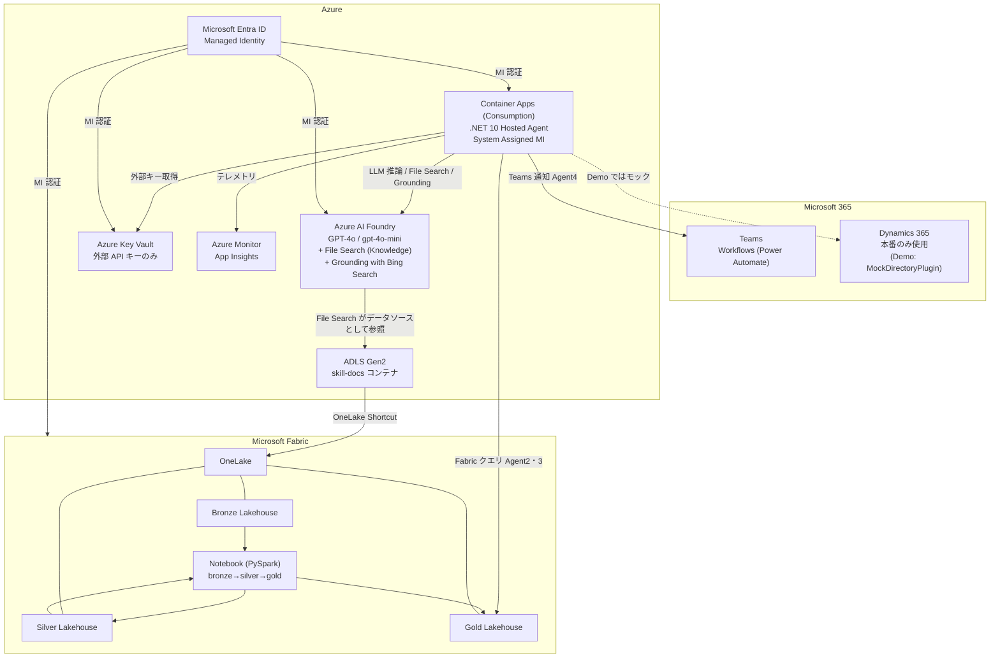
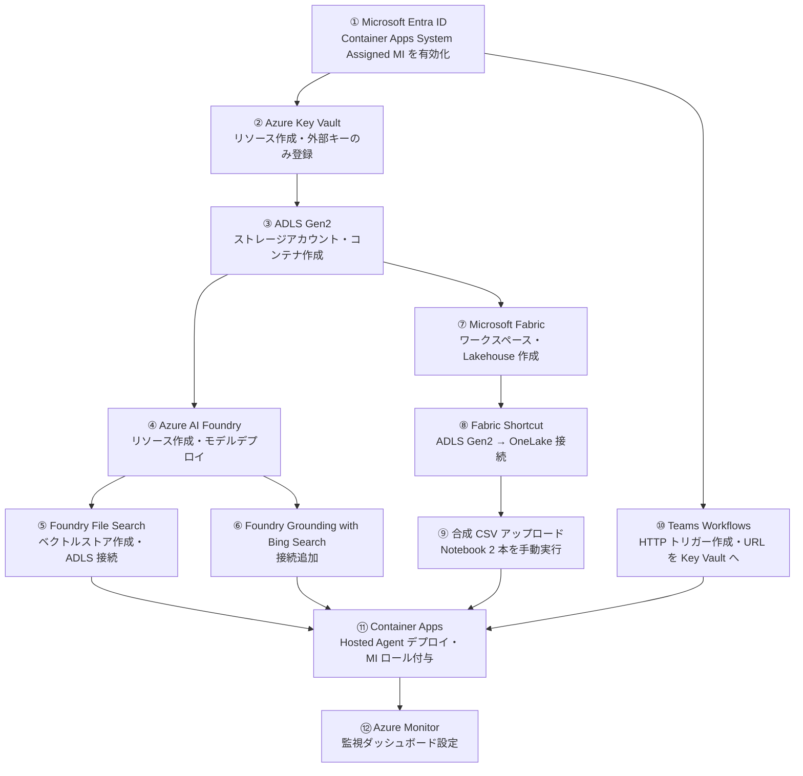

# 09. Azure / M365 必要構成まとめ

関連: [開発計画 README](README.md) | [Azure 詳細設定](05-azure-configuration.md) | [Fabric 取り込み設計](06-fabric-data-ingestion.md) | [Skill/DS 設計](08-skill-ds-design.md)

---

## サービス全体マップ

---

## Azure サービス一覧

### 必須サービス

| サービス | SKU / ティア | 用途 | 参照エージェント |
|---|---|---|---|
| **Azure AI Foundry** | Standard（リソース名: `fd-PathnerIQ` / リージョン: `<要確認>`） | LLM 推論（GPT-4o / gpt-4o-mini）、File Search (Knowledge)、Grounding with Bing Search | 全エージェント |
| **ADLS Gen2** | Standard LRS | Skill.md ファイル格納・OneLake Shortcut 基盤 | Agent 2・3 / Fabric |
| **Microsoft Fabric** | F2～F4 | データレイク / OneLake / Notebook | Agent 2・3 |
| **Azure Key Vault** | Standard | 外部サービス API キーのみ | Agent 4 他 |
| **Azure Container Apps** | Consumption | .NET 10 Hosted Agent のホスティング（System Assigned MI） | - |
| **Microsoft Entra ID** | 既存テナント | Managed Identity | 全サービス |

### 推奨サービス

| サービス | SKU / ティア | 用途 |
|---|---|---|
| **Azure Monitor / App Insights** | Pay-as-you-go | エージェント実行ログ・トークン使用量・レイテンシ監視 |
| **Azure Container Registry** | Basic | .NET 10 コンテナイメージ管理 |

### Demo では使用しないサービス

| サービス | 理由 |
|---|---|
| **Azure AI Search** | Skill.md / DS.md の総量が 100KB 未満のため Basic SKU でも過剩。Foundry **File Search** に統一 |
| **Bing Search v7 API（単体）** | 新規受付停止。Foundry 組込の Grounding with Bing Search を使用 |
| **App Service （P1v3）** | Container Apps Consumption と重複。Demo は使用時のみ課金の Consumption に統一 |

---

## Azure AI Foundry 構成詳細

| 項目 | 設定値 |
|---|---|
| リソース名 | `fd-PathnerIQ` |
| リージョン | `<要確認>` |
| モデルデプロイ 1 | `gpt-4o`（Agent 1・2・3 用） |
| モデルデプロイ 2 | `gpt-4o-mini`（Agent 4 用） |
| Knowledge / File Search | `<要確認: ベクトルストア名>`（Skill.md / DS.md 参照） |
| Grounding with Bing Search 接続 | Foundry Connections で追加し Connection ID を保持 |
| Fabric 接続 | OneLake / SQL Analytics Endpoint（Gold Lakehouse） |
| 認証 | Container Apps の System Assigned MI に `Cognitive Services User` を付与 |

### モデル設定

| エージェント | デプロイ名 | 最大トークン | 温度 |
|---|---|---|---|
| Agent 1 (Web収集) | `gpt-4o` | 4,096 | 0.3 |
| Agent 2 (インパクト評価) | `gpt-4o` | 8,192 | 0.1 |
| Agent 3 (レコメンド × 3事業部) | `gpt-4o` | 8,192 | 0.2 |
| Agent 4 (通知) | `gpt-4o-mini` | 2,048 | 0.0 |

---

## Foundry File Search（Skill.md / DS.md ベクトルストア）

| 項目 | 設定値 |
|---|---|
| ベクトルストア名 | `<要確認: Foundry Portal で作成したベクトルストア名>` |
| データソース | ADLS Gen2 `<要確認: ADLS アカウント名> / skill-docs` |
| 再インデクシング | Foundry が Blob 変更を検知して自動実行 |
| チャンク分割 | デフォルト（1024 tokens 目安） |
| Agent 2・3 での利用 | `FoundryFileSearchTool`、Vector Store ID を `Foundry:FileSearchVectorStoreId` で供給 |

---

## ADLS Gen2 構成詳細

| 項目 | 設定値 |
|---|---|
| アカウント名 | `<要確認: ADLS Gen2 ストレージアカウント名>` |
| 冗長性 | LRS（デモ用途） |
| コンテナ名 | `skill-docs` |
| ディレクトリ構成 | `mobile/`, `ecommerce/`, `fintech/` |
| Fabric 連携 | OneLake Shortcut（`skill-docs` → `fabric_seworkshop_ws1/Files/skill-docs`） |
| アクセス制御 | Foundry File Search・Container Apps MI に `Storage Blob Data Reader` を付与 |

---

## Microsoft Fabric 構成一覧

| リソース | 名称 | 用途 |
|---|---|---|
| Workspace | `fabric_seworkshop_ws1` | 全 Fabric リソースの管理単位 |
| Bronze Lakehouse | `<要確認>` | 合成 CSV をそのまま取り込み |
| Silver Lakehouse | `<要確認>` | クレンジング・型整備済みデータ |
| Gold Lakehouse | `<要確認>` | AI エージェント向け集計テーブル |
| Notebook | `nb_bronze_to_silver` | Bronze → Silver 変換（PySpark） |
| Notebook | `nb_silver_to_gold` | Silver → Gold KPI 集計（PySpark） |
| OneLake Shortcut | `skill-docs` | ADLS Gen2 の Skill.md を透過参照 |

> Demo では Data Pipeline / Dataflow Gen2 / スケジューラーは作成せず Notebook を手動実行する。オンプレデータゲートウェイも不要。

---

## M365 サービス一覧

| サービス | 用途 | 担当エージェント | 必須/任意 |
|---|---|---|---|
| **Microsoft Teams (Workflows)** | Adaptive Card でレコメンドを各事業部責任者へ通知 | Agent 4 | 必須 |
| **Dynamics 365** | 本番での担当者ディレクトリ・レコメンド記録 | Agent 4 | **Demo では使わずモック** |
| **Outlook / M365 Mail** | Demo スコープ外（使用しない） | - | 対象外 |

### Teams 構成（Workflows）

| 項目 | 設定値 |
|---|---|
| 接続方式 | Power Automate Workflows（「チャネルへメッセージを投稿」テンプレート + HTTP トリガー） |
| チャネル構成 | `#mobile-ai-recommend`, `#ecommerce-ai-recommend`, `#fintech-ai-recommend` |
| カード形式 | Adaptive Card v1.5 |
| @メンション | 優先度 HIGH のアクションは担当者をメンション（Workflow 内で設定） |

> Incoming Webhook コネクターは段階的に廃止予定のため未採用。Demo ・ 本番とも Workflows で統一する。

### Dynamics 365（Demo ではモック）

Demo は `MockDirectoryPlugin`（メモリ内の担当者一覧）で代替する。以下は本番での接続仕様。

| 項目 | 設定値 |
|---|---|
| 接続方式 | Dataverse Web API（Microsoft.PowerPlatform.Dataverse.Client） |
| 用途 1 | 事業部責任者の照会（取引先担当者エンティティ） |
| 用途 2 | AI レコメンドのカスタムエンティティへの記録 |
| 認証 | Service Principal（Entra ID App Registration） |

---

## Microsoft Entra ID 構成

### Managed Identity（Hosted Agent 用）

| 項目 | 設定値 |
|---|---|
| アイデンティティ | Container Apps `<要確認: Container Apps アプリ名>` の **System Assigned Managed Identity** |
| 用途 | Foundry / Fabric / Key Vault へのアクセス |
| 認証コード | `DefaultAzureCredential`（.NET 10） |

> Demo では Service Principal シークレットや API キーを使わず、Container Apps の System Assigned MI を Azure リソースの認証に統一する。

### ロール割り当て一覧

| リソース | ロール | 付与対象 |
|---|---|---|
| Azure AI Foundry | Cognitive Services User | Container Apps MI |
| ADLS Gen2 (`<要確認: ADLS アカウント名>`) | Storage Blob Data Reader | Container Apps MI / Foundry File Search |
| Fabric Workspace `fabric_seworkshop_ws1` | Viewer | Container Apps MI |
| Key Vault (`<要確認: Key Vault 名>`) | Key Vault Secrets User | Container Apps MI |
| Azure Monitor (App Insights) | Monitoring Metrics Publisher | Container Apps MI |

---

## Key Vault シークレット一覧

Azure リソースへの認証は Managed Identity に統一し、Key Vault には **外部サービスの API キー** のみ保持する。

| シークレット名 | 内容 | 参照箱所 | 有効性 |
|---|---|---|---|
| `Teams--WorkflowsUrl` | Teams Workflows の HTTP トリガー URL | Agent 4 | Demo 使用 |
| `AzureMonitor--ConnectionString` | App Insights 接続文字列 | ホスト全体 | Demo 使用（推奨） |
| `Dynamics365--ClientSecret` | Dynamics 365 Service Principal シークレット | Agent 4 | 本番のみ |

> Foundry / Fabric / Key Vault への認証は Managed Identity で行うため API キーは保持しない。古いシークレット (`AzureOpenAI--ApiKey` / `BingSearch--ApiKey` / `AzureAISearch--ApiKey` / `Teams--*--WebhookUrl`) は本設計では採用しない。

---

## 構築順序（推奨・Demo）

> Dynamics 365 / オンプレデータゲートウェイ は Demo では作成しない。

---

## コスト概算（月次・デモ規模）

| サービス | 想定コスト帯 | 備考 |
|---|---|---|
| Azure AI Foundry (GPT-4o / mini) | $200～$500 | デモ頻度・トークン数による |
| Foundry Grounding with Bing Search | $10～$30 | クエリ数・未使用月は $0 |
| ADLS Gen2 | $5 以下 | Skill.md は小容量 |
| Azure Container Apps (Consumption) | $0～$30 | リクエスト時のみ課金。デモ未実行時は $0 |
| Azure Container Registry (Basic) | $5 | 固定 |
| Azure Key Vault | $1 以下 | シークレット数件 |
| Azure Monitor | $10～$30 | ログ量による |
| Microsoft Fabric (F2～F4) | $250～$500 | Fabric 容量ライセンス（テナント単位で一括課金） |
| Dynamics 365 | $0 | Demo では使わずモック |
| Microsoft 365 (Teams Workflows) | 既存ライセンス内 | 追加コストなし |
| **合計目安** | **$481～$1,101 / 月** | Fabric 容量を含む |
| **Fabric 除く合計** | **$231～$601 / 月** | 既存 Fabric テナントを利用する場合 |

> Azure AI Search Basic（$75/月）を廃止し Foundry File Search に統一したこと、Container Apps Consumption を採用したことで App Service (P1v3 / $70) を削減している。
> リージョンは `fd-PathnerIQ` の既存リージョンに合わせる（`<要確認>`）。

---

## 要確認の設定値一覧

ドキュメント内の `<要確認>` マーカーを実際の値に置き換える前に、以下を確認・決定してください。

| No. | 項目 | 現在の仮名 / プレースホルダー | 確認方法 |
|---|---|---|---|
| 1 | **Azure AI Foundry リージョン** | `<要確認>` | Azure Portal → `fd-PathnerIQ` リソースの「概要」 |
| 2 | **Foundry Project 名** | `<project-name>` | Azure AI Foundry Portal → プロジェクト一覧 |
| 3 | **Foundry Project Endpoint URL** | `https://fd-pathneriq.services.ai.azure.com/api/projects/<project-name>` | Foundry Portal → プロジェクト → 概要 → エンドポイント |
| 4 | **Fabric Gold Lakehouse 名** | `<要確認>` | Fabric ワークスペース `fabric_seworkshop_ws1` のアイテム一覧 |
| 5 | **Fabric Silver Lakehouse 名** | `<要確認>` | 同上 |
| 6 | **Fabric Bronze Lakehouse 名** | `<要確認>` | 同上 |
| 7 | **Fabric SQL Analytics Endpoint** | `fabric_seworkshop_ws1.datawarehouse.fabric.microsoft.com` | Gold Lakehouse → SQL Analytics Endpoint → 接続文字列 |
| 8 | **ADLS Gen2 アカウント名** | `<要確認>` | Azure Portal → ストレージアカウント一覧（または新規作成） |
| 9 | **Foundry File Search ベクトルストア名** | `<要確認>` | Foundry Portal → Knowledge |
| 10 | **Azure Key Vault 名** | `<要確認>` | Azure Portal → Key Vault（または新規作成） |
| 11 | **Container Apps リソースグループ名** | `<要確認>` | Azure Portal → リソースグループ一覧 |
| 12 | **Container Apps 環境名** | `<要確認>` | Azure Portal → Container Apps 環境（または新規作成） |
| 13 | **Container Apps アプリ名** | `<要確認>` | 新規作成時に決定 |

> **既に存在するリソース**（`fd-PathnerIQ`・`fabric_seworkshop_ws1`）に合わせて、他のリソース名・リージョンを決定することを推奨します。
